<p align="center">
  <!-- The PNGs, not the SVGs: the mark is a photograph embedded as a data URI,
       and GitHub sanitises the SVGs it serves. The PNGs are rasterised from
       those same SVGs, so they cannot drift. -->
  <picture>
    <source media="(prefers-color-scheme: dark)" srcset="assets/signbridge-wordmark-dark.png" />
    
  </picture>
</p>

<p align="center">
  
</p>

<p align="center">
  <b>Postman for AWS SigV4 — self-hosted.</b><br/>
  Presign any AWS API, invoke it live, browse S3 and look <i>inside</i> the objects,
  run boto3 in a sandbox, and hand the whole thing to your IDE over MCP.<br/>
  Signs with your IAM keys, your SSO roles, a remote EC2 instance role, or an EKS IRSA
  service account.
</p>

---

## ⚡ Up and running in 60 seconds

**One prerequisite: Docker.** No Node, no npm, no AWS CLI, no account, no login.

```bash
docker compose up --build -d
```

Open **<https://localhost:2443/signbridge/dashboard>** and accept the self-signed
certificate (expected for local HTTPS).

That's the whole install. Specifically, there is nothing to do about:

| | |
| --- | --- |
| **Config** | `config.properties` is tracked with working defaults. Nothing to copy, no `.env`, no slot for a secret. |
| **TLS** | A self-signed cert is generated on first run into `~/.signbridge/keys/`. |
| **Login** | There is none. The app runs as one local user (`signbridgeuser`). |
| **AWS profiles** | Your `~/.aws` is mounted and imported automatically. For SSO, run `aws sso login --profile <name>` on the host first. |
| **Sandbox image** | Built for you as a one-shot service during `docker compose up`. |
| **AI key** | Only needed if you want Chat, and you add it *in the app* — see [Bring your own LLM](#bring-your-own-llm). |

Then: pick a profile → paste an endpoint → **Presign** or **Invoke**.

## 🧩 Use it from your IDE — MCP, two ways

SignBridge exposes **58 tools** — full dashboard parity — to Claude, Cursor and
Codex. Two transports, one shared tool set; pick whichever your client speaks.
Both are thin clients of the SignBridge API, so **the app must be running**.

**You do not need an AI provider key for any of this.** Over MCP *your client is
the model*. Configure SignBridge in Codex or Cursor and every tool works with
nothing set up in Settings.

### a) stdio — Claude Desktop / Cursor / Codex

Nothing to install or clone. Straight from this repository:

```json
{
  "mcpServers": {
    "signbridge": {
      "command": "npx",
      "args": ["-y", "github:rajesh-bijja/signbridge"]
    }
  }
}
```

That is the whole config: it defaults to the local SignBridge and its local user.
`npx` clones once and caches, so the first start takes a minute and later ones do
not. **No subdirectory suffix** — npm cannot install one directory of a repository,
and accepts `#main::path:mcp` while installing the root anyway, so the root declares
the executable and the bare spec is what to write.

From npm instead, once the package is published — smaller, four dependencies rather
than the whole backend's:

```json
{
  "mcpServers": {
    "signbridge": {
      "command": "npx",
      "args": ["-y", "signbridge-mcp"]
    }
  }
}
```

Or from a clone, with no download at all:

```json
{
  "mcpServers": {
    "signbridge": {
      "command": "node",
      "args": ["/absolute/path/to/signbridge/mcp/server.js"]
    }
  }
}
```

All three run the same server and expose the same 58 tools. Register **one** — two
entries give your client two copies of every tool.

### b) Streamable HTTP — already running on port 2444

The server mounts MCP in-process, so there is no second thing to start:

```json
{
  "mcpServers": {
    "signbridge": {
      "url": "http://localhost:2444/signbridge/mcp"
    }
  }
}
```

Some clients name that key `serverUrl` or want `"type": "http"` alongside it — check
yours. Either way the URL is the only value you supply.

**Use port 2444, not 2443.** MCP clients connect with Node's `fetch`, which rejects
SignBridge's self-signed certificate and reports only `fetch failed` — and there is
nowhere in those clients to trust one certificate. So SignBridge also serves the MCP
endpoint, and nothing else, on 2444 without TLS. It listens on loopback only, so
those bytes never leave your machine; `https://localhost:2443/signbridge/mcp` still
works for a client that can trust the cert. Set `[server] mcpHttpPort=0` to turn
2444 off and use stdio instead.

See [MCP reference](#mcp-reference) for the tool list, the optional environment
overrides, and what is deliberately *not* a tool.

## 📸 The tour

### Presign or invoke any AWS API — not just S3

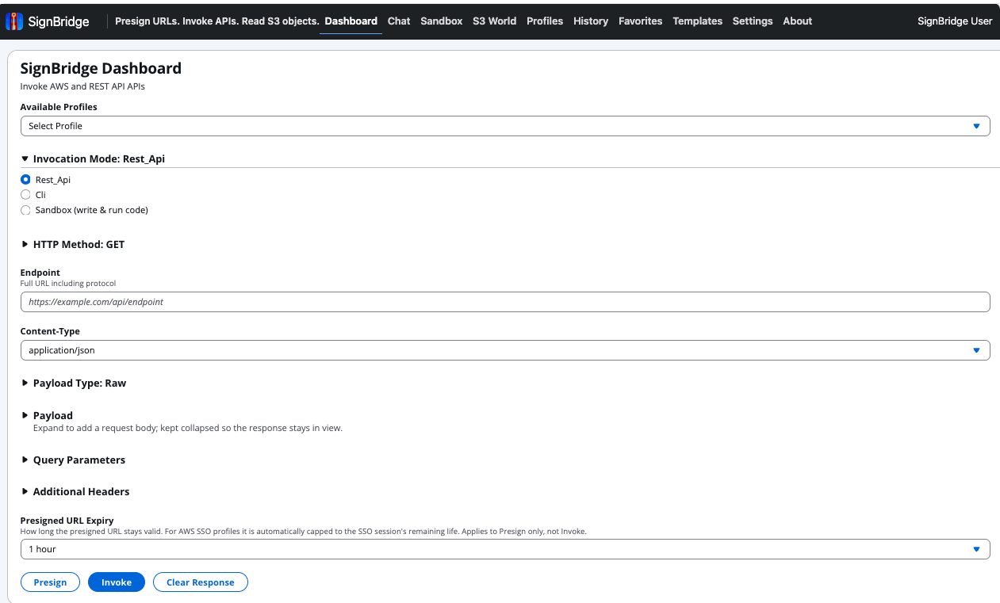

*Pick a profile, choose an invocation mode (`Rest_Api`, `Cli`, or `Sandbox`), paste
an endpoint, and get either a shareable presigned URL or the live response inline.
**Presigned URL Expiry** is a dropdown — and for SSO profiles SignBridge caps it to
the session's real remaining life rather than advertising an hour it cannot honor.*

### One profile, seven ways to authenticate

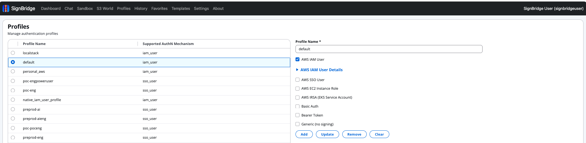

*Profiles from `~/.aws` import themselves; you add the rest here. A single profile
can declare several mechanisms — IAM keys, **AWS SSO / IAM Identity Center**, a
remote **EC2 instance role** read over SSH + IMDSv2, an **EKS IRSA** service
account (no `kubectl`, no kubeconfig), plus Basic Auth, Bearer/OAuth2 and unsigned
generic REST. Saving an EC2 or IRSA profile tests the connection then and there.*

### Sandbox — write boto3, press Run

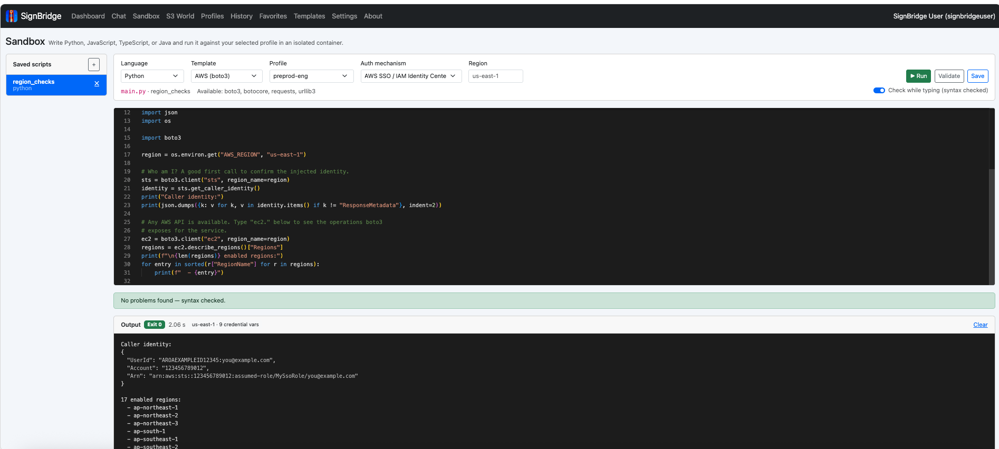

*Raw SigV4 is an occasional need; five lines of boto3 is how most people actually
explore an API. Write Python, JavaScript, TypeScript or Java with AWS-aware
autocomplete and real compiler diagnostics, then run it in a throwaway container
that already holds the SDKs and the selected profile's credentials. Nothing
installed locally, nothing left behind.*

### 429 AWS services, ready to import

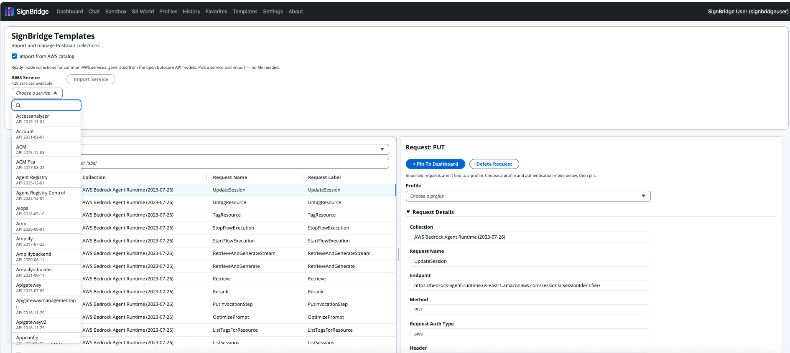

*Templates are Postman-style collections — import your own, or generate one from
the open botocore API models with a click. Every operation of every AWS service
arrives with its endpoint, method and headers filled in; **Pin To Dashboard** sends
one straight to the request form.*

### S3 World — see *inside* the object, not just its name

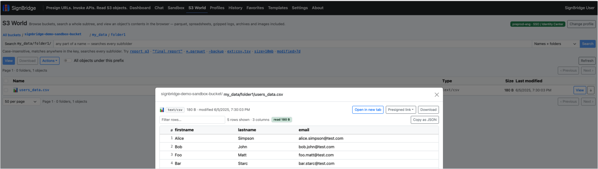

Open `/signbridge/s3world` and "what's in this file?" is a click, not a download:
parquet as a table, `.xlsx` as sheets, a `.log.gz` as text, a tarball as a member
list, a notebook as cells, JSON/XML/YAML as a navigable tree. Search is recursive,
case-insensitive and matches **anywhere** in the key — and it finds folders, including
empty ones. See [S3 World](#s3-world) for the full format list and search syntax.

Every object you open carries the same four actions — and one of them is a link that
expires:

<p align="center">
  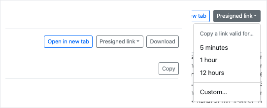
</p>

***Open in new tab** for anything the browser renders natively, **Download**, **Copy**
for the decoded text, and **Presigned link** — 5 minutes, 1 hour, 12 hours, or
**Custom…**, anything from 1 minute up to the 12-hour maximum AWS SigV4 allows. The
confirmation reports the lifetime the link **actually** got, which matters on an SSO
profile: a presigned URL cannot outlive the session credentials that signed it, so
SignBridge caps it rather than promising an hour it cannot honor.*

### Chat — say it in English, it drives the same actions

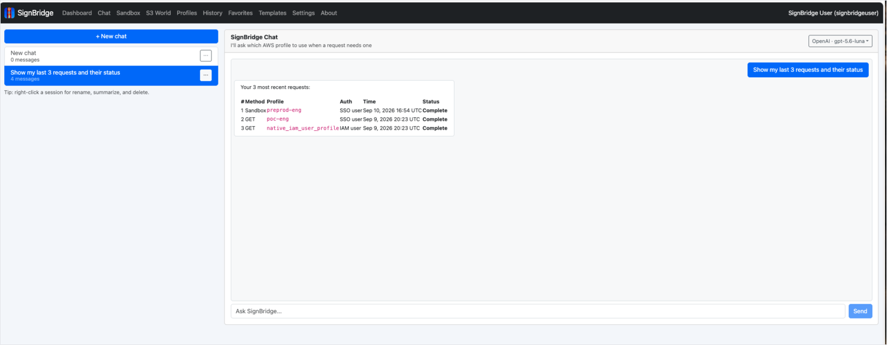

*A tool-calling agent wired to the **same** 58 actions as the dashboard and the MCP
server: "presign a DescribeInstances call for an hour", "re-invoke my last request and
tell me what failed", "what's in the newest parquet under `s3://logs/2026/`". It asks
which profile to use rather than guessing, and every session is saved — right-click to
rename, summarize or delete. See [AI Chat](#ai-chat).*

### Your key, your provider — set up in the app, no file to edit

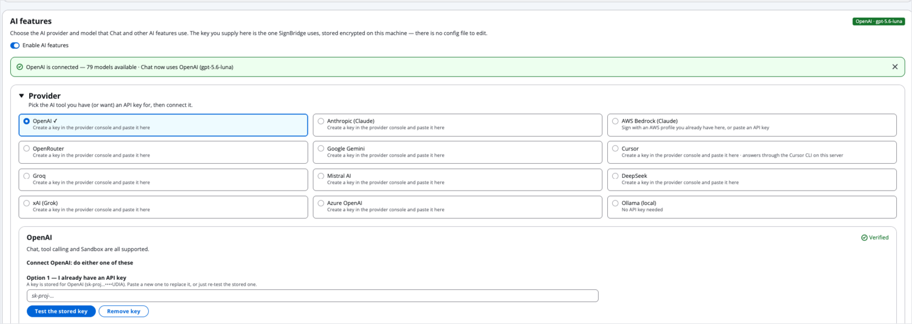

*Twelve providers. Paste a key in **Settings → AI features** and SignBridge verifies it,
then lists the models that key can actually reach. Stored encrypted (AES-256-GCM) on
your machine — there is no config file and no environment variable that can supply a
key instead. **AWS Bedrock needs no key at all**: sign with an AWS profile you already
have here. See [Bring your own LLM](#bring-your-own-llm).*

### Nothing you run is lost — history remembers the whole exchange

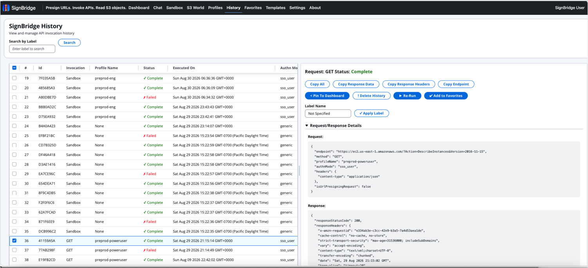

*Every presign and invoke is saved with its profile, mechanism, status and time.
Click a row and the **whole exchange** comes back — request, response headers,
body — with **Re-Run**, **Pin To Dashboard**, **Add to Favorites** and one-click
copies. Label a run and you can find it again by name.*

### Favorites — the handful you actually repeat

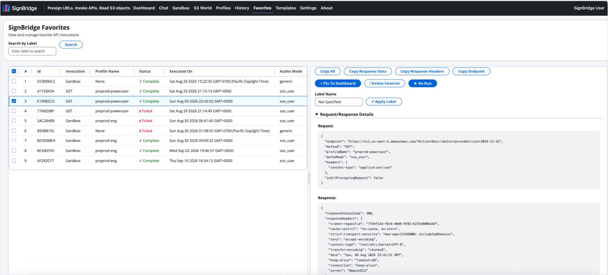

*Promote a run out of history and it lives here, with the same detail panel and the
same **Re-Run**. Useful when three requests out of two hundred are the ones you
reach for every day.*

## What you can do with it

- 🔏 **Presign any AWS API** — not just S3. A shareable, time-boxed URL for EC2,
  STS, IAM, S3 and the rest.
- 🚀 **Invoke live requests** — SigV4 (IAM keys, SSO, EC2 instance role, IRSA),
  REST Basic/Bearer/OAuth2, or unsigned — response inline, saved to history.
- 🌉 **Bridge IAM & SSO** — SSO / IAM Identity Center is a first-class signing
  identity, with automatic STS refresh and expiry-aware presigning.
- 🖥️ **Borrow a remote role** — an EC2 instance's own role over SSH + IMDSv2, or an
  EKS IRSA service account's role, without copying a key or installing `kubectl`.
- 🧪 **Sandbox mode** — a real editor (Python, JS, TS, Java) with AWS autocomplete,
  running in a throwaway container with your profile's credentials.
- 🪣 **S3 World** — browse buckets *and see inside the objects*, with a search that
  matches anywhere in a key.
- 🤖 **Chat copilot** — on by default; bring your own LLM from 12 providers,
  configured in the app, keys encrypted at rest.
- 🧩 **MCP server** — every action exposed to Claude, Cursor and Codex over stdio
  **or** HTTP.
- 📦 **Self-hostable & air-gappable** — file-based state under `~/.signbridge`,
  running entirely on your machine.

## What this is

| Layer | Technology |
| --- | --- |
| UI | React 18 + Bootstrap nav + Cloudscape forms |
| Realtime | Socket.IO |
| API | Express HTTPS on port 2443 under `/signbridge/` |
| Auth | None — a single local user, no login |
| AWS | IAM keys, SSO profiles, EC2 instance roles (SSH + IMDSv2), EKS IRSA (no kubectl), SigV4 presign/invoke, AWS CLI mode |
| REST | Basic Auth, Bearer token (static or OAuth2), generic unsigned |
| Sandbox | Monaco editor + Python / JS / TS / Java in a throwaway Docker container |
| S3 World | Bucket browser + recursive search + in-browser object viewers (parquet, xlsx, docx, archives, notebooks, media, PDF, …) |
| AI Chat | Multi-turn tool-calling agent, **on by default**; 12 LLM providers configured in-app, keys encrypted at rest |
| MCP | stdio server **and** in-process HTTP endpoint — full dashboard parity |
| Storage | File-based, under `~/.signbridge/` (artifacts + TLS certs; LLM keys sealed with AES-256-GCM) |

<!-- BEGIN:COMPARISON (generated from frontend/src/data/comparison.mjs) -->

## How SignBridge compares

No single tool combines everything SignBridge does. Plenty of tools do pieces of it — sign a request, run one from the CLI, proxy it — but the specific bundle of a self-hostable UI that presigns and invokes arbitrary AWS SigV4 APIs, treats AWS SSO / IAM Identity Center as a first-class signing identity, and layers generic REST, AI chat, and MCP on top does not exist as one product. The closest alternatives each miss at least one of these pillars.

| Capability | **SignBridge** | Postman | awscurl | aws-sigv4-proxy | AWS CLI / boto3 | Insomnia / Bruno / Hoppscotch |
| --- | --- | --- | --- | --- | --- | --- |
| Presign URLs (shareable) | ✅ | ⚠️ | ❌ | ❌ | ⚠️ | ⚠️ |
| Invoke live requests | ✅ | ✅ | ✅ | ✅ | ✅ | ✅ |
| SigV4 for any AWS service (beyond S3) | ✅ | ✅ | ✅ | ✅ | ✅ | ⚠️ |
| AWS SSO / IAM Identity Center as signing identity | ✅ | ❌ | ❌ | ⚠️ | ✅ | ❌ |
| Sign as a remote EC2 instance role or EKS IRSA role | ✅ | ❌ | ⚠️ | ⚠️ | ⚠️ | ❌ |
| Auto session refresh + expiry-aware presign | ✅ | ❌ | ❌ | ⚠️ | ❌ | ❌ |
| Graphical UI | ✅ | ✅ | ❌ | ❌ | ❌ | ✅ |
| Generic / non-AWS REST (Basic, Bearer) | ✅ | ✅ | ❌ | ❌ | ❌ | ✅ |
| Self-hostable / air-gappable | ✅ | ⚠️ | ✅ | ✅ | ✅ | ⚠️ |
| Browse S3 and view object contents in-browser | ✅ | ❌ | ❌ | ❌ | ⚠️ | ❌ |
| MCP server (AI / IDE integration) | ✅ | ⚠️ | ❌ | ❌ | ❌ | ⚠️ |

Legend: ✅ full · ⚠️ partial / indirect · ❌ not supported.

### Where SignBridge stands out

- **SSO / IAM Identity Center as a first-class signing identity.** Most REST clients only handle static IAM access keys. On SSO you would otherwise run `aws sso login`, copy the temporary access key, secret, and session token by hand, and repeat every time the session rolls. SignBridge reads ~/.aws, performs the STS GetRoleCredentials exchange, caches and auto-refreshes, and caps a presigned URL's expiry to the session's real remaining life — so it never advertises an hour it cannot honor.
- **Signing as an EC2 instance role or an EKS IRSA role, from your own machine.** Every other tool here can use an instance role or an IRSA role only when it is already running on that instance or inside that pod — which is why debugging "works locally, AccessDenied in the pod" means SSHing in or exec'ing into a container. SignBridge makes both of them ordinary profiles: point one at a host you can SSH into and it reads the role over IMDSv2; pick a cluster and a service account and it mints that account's projected token and exchanges it via AssumeRoleWithWebIdentity. No kubectl, no kubeconfig, nothing installed — and the resulting credentials presign and invoke exactly like any other profile.
- **Presigning for arbitrary AWS APIs, not just S3.** The AWS SDKs only expose presigners for a handful of services. SignBridge presigns any SigV4 endpoint (EC2 DescribeInstances, STS, and more) and hands you a shareable URL. Tools like awscurl and aws-sigv4-proxy can only invoke — they never produce a URL you can pass on.
- **S3 World: seeing inside an object, not just listing it.** AWS's Storage Browser for Amazon S3 and the open-source explorers (aws-js-s3-explorer, aws-s3-bucket-browser, and friends) give you a polished folder view and bulk operations — and then stop at download. S3 World browses the same way, but resolves what an object actually is (extension, stored type, magic bytes) and renders it: parquet as a table, an .xlsx as sheets, a .log.gz as text, a tarball as a member list, a notebook as cells. Its search is recursive, case-insensitive, and matches anywhere in the key, where the console's is a case-sensitive single-level prefix filter.
- **One self-hostable UI over the whole workflow.** Presign, invoke, AWS CLI passthrough, generic REST, history, favorites, templates, and an MCP server so Cursor / Claude can drive it — all behind a single UI you run yourself, with file-based artifacts under your control. Postman is the only tool with comparable surface area, but it is cloud-first, has no SSO signing, and no MCP-into-AWS bridge.

### Honest caveats

- Postman is the real surface-area competitor. If you already live in Postman with static IAM keys, SignBridge's wedge is specifically SSO-native signing, self-hosting, correct expiry semantics, and MCP.
- The invoke and CLI-passthrough pieces are commoditized (awscurl, aws-sigv4-proxy, the AWS CLI itself). Those are table stakes SignBridge bundles in — the signing + bridging is the unique part.
- For plain S3 browsing, uploads, and bulk operations, the AWS console and Storage Browser for Amazon S3 are perfectly good and better integrated with IAM. S3 World's wedge is viewing an object's contents without downloading it, and a search that finds a key by any part of its name.

<!-- END:COMPARISON -->

## Profiles & auth modes

Create profiles on the **Profiles** page. Each declares one or more mechanisms:

| Mode | Description |
| --- | --- |
| `sso_user` | AWS SSO / IAM Identity Center — SigV4 |
| `iam_user` | IAM access key/secret — SigV4 |
| `ec2_instance` | An EC2 instance's attached role, read over SSH + IMDSv2 — SigV4 |
| `irsa` | An EKS IRSA service-account role, via `AssumeRoleWithWebIdentity` — SigV4 |
| `rest_basic_auth` | HTTP Basic Auth (username + password) |
| `rest_bearer_token` | Bearer token — static, or fetched via OAuth2 |
| `generic` | Plain request, no signing |

All four AWS mechanisms produce the same credential shape, so presign, invoke,
"Copy as curl", AWS CLI mode, Sandbox and S3 World work with every one of them.
IAM/SSO profiles can also be **synced back to `~/.aws/config`**, so a profile you
create here is usable from the AWS CLI.

<details>
<summary><b>EC2 instance role — fields, and what it does under the hood</b></summary>

Sometimes the credentials you need are not on your laptop at all — they are the
role attached to an EC2 box. The usual workaround is to SSH in, `curl` IMDS by
hand, and paste three values into a shell. An `ec2_instance` profile does that for
you, on every signing operation.

| Field | Notes |
| --- | --- |
| **EC2 host** | Public/private IP **or** DNS hostname |
| **SSH username** | e.g. `ec2-user`, `ubuntu` |
| **SSH port** | Defaults to `22` |
| **SSH private key** | Paste it, or **drop the `.pem` file** on the field — plus an optional passphrase |
| **SSH password** | The alternative to a key |

The key and the password are a **radio choice, not two optional boxes**: the form
lets you supply exactly one, so "which did I mean?" is never a question the backend
has to guess at. Saving the profile also **tests the connection** — you get the
instance id, its region and the attached role name back on success, and the real
SSH failure (`Permission denied (publickey)`, timeout, DNS) on failure, rather than
a profile that silently doesn't work until you first try to sign with it.

Under the hood SignBridge opens an SSH session (via the `ssh2` library — no system
`ssh`, no shelling out) and walks IMDSv**2**: `PUT /latest/api/token` with a 6-hour
TTL, then the identity document, then
`/latest/meta-data/iam/security-credentials/<role>`. The token step is not optional
— IMDSv1 is disabled on any instance configured `HttpTokens=required`, which is now
the default for new launch templates.

Credentials are cached on the profile and re-read when they are within 5 minutes of
expiry; anything shown back to you is **masked** (`ASIA****1234`), and the secret is
never logged or persisted in the clear.

</details>

<details>
<summary><b>EKS IRSA — the five picks, and the two RBAC permissions people miss</b></summary>

IRSA (IAM Roles for Service Accounts) is how a pod gets an AWS role: the service
account is annotated with `eks.amazonaws.com/role-arn`, the pod gets a projected
OIDC token, and it exchanges that for the role. An `irsa` profile lets *you* sign as
that same role — exactly what you want when debugging "works from my laptop, the
pod gets AccessDenied".

> **`kubectl` is not required.** Nor is `aws eks update-kubeconfig`, a kubeconfig
> file, or anything else installed locally or in the container. SignBridge talks to
> the EKS Kubernetes API directly, authenticating with an EKS-style
> `k8s-aws-v1.<presigned STS GetCallerIdentity URL>` token — the same token
> `aws eks get-token` produces, built in-process.

You pick, in this order, each step populated from the one before:

1. **Base AWS profile** — an ordinary `sso_user` or `iam_user` profile, used *only*
   to reach EKS and read the role. (EC2 and IRSA profiles are deliberately not
   offered as a base — no chaining.)
2. **Region** — defaults to `us-east-1`.
3. **Cluster** — from `eks:ListClusters`.
4. **Service account** — every service account in the cluster carrying the
   `eks.amazonaws.com/role-arn` annotation, with the role it points at.
5. **The role's trust policy is read, not assumed** — `iam:GetRole` gives the
   `AssumeRolePolicyDocument`, and SignBridge pulls the required audience out of its
   `:aud` condition and tells you whether *this* service account's subject
   (`system:serviceaccount:<ns>:<name>`) is actually trusted. If `iam:GetRole` is
   denied that is a note rather than a blocker.

Then **Test connection** runs the real thing end to end: mint the service account's
token and exchange it via `sts:AssumeRoleWithWebIdentity`, reporting the assumed
role ARN.

The base profile needs `eks:ListClusters`, `eks:DescribeCluster` and (ideally)
`iam:GetRole`, **and** it must be mapped in the cluster's access entries /
`aws-auth` ConfigMap. Two *different* Kubernetes RBAC permissions are involved, and
having the first without the second is normal — read-only cluster roles such as
`view` grant listing but not token creation:

| Step | Kubernetes permission |
| --- | --- |
| Load service accounts | `list` / `get` on `serviceaccounts` |
| Test connection, and every signing operation | `create` on the **`serviceaccounts/token`** subresource, in that namespace |

So a cluster where the dropdown fills in happily but **Test connection** returns
`403 … cannot create resource "serviceaccounts/token"` is not an AWS IAM or
access-entry problem — the identity is already mapped. SignBridge's error says
exactly that, names the namespace, and quotes the rule to grant:

```yaml
# Role in the service account's namespace, bound to your identity with a RoleBinding.
rules:
  - apiGroups: [""]
    resources: ["serviceaccounts/token"]
    verbs: ["create"]
    resourceNames: ["my-service-account"]   # optional, to narrow it
```

**In AWS CLI mode**, `ec2_instance` and `irsa` credentials are handed to the CLI
through the environment — so **do not put `--profile` in the command**. A named
profile makes the CLI ignore the environment and read `~/.aws/config` instead,
which produces a confusing "profile not found" or, worse, signs as the wrong
identity.

</details>

<details>
<summary><b>Bearer Token — static, or OAuth2 with the token field detected for you</b></summary>

- **Static token** — paste it; sent as `Authorization: Bearer <token>`.
- **OAuth2 fetch** — SignBridge fetches a token at invoke time from your token
  endpoint (`client_credentials` and `password` grants). Providers differ, so the
  request form fields are **fully customizable**: add, remove and edit key/value
  pairs (`client_id`, `client_secret`, `audience`, `connection`, `scope`, …).

**"Token to use" is detected, not guessed.** The selector appears only *after* you
click **Test Connection**: the live response is inspected and the right field
recommended — `access_token` for `client_credentials`, `id_token` for `password`
(falling back to `access_token`). If the expected token isn't in the response the
test fails with a clear error instead of silently choosing the wrong one. Editing
any token-fetch field re-arms the test.

**Automatically renew the token on expiry** — a checkbox. A token that passed Test
Connection can still expire before you invoke. Checked, an expired token is
silently re-fetched; unchecked, you get a clear error asking you to enable
auto-renew or re-test. Applies to the dashboard, chat and MCP alike. Tokens are
cached in memory per profile, never persisted.

</details>

## S3 World

The AWS console lets you browse a bucket and download a file. To *look* at that
file you download it, find it, open it in something that understands the format,
and lose your place. **S3 World** removes that round trip.

Open **S3 World** in the nav (**`/signbridge/s3world`**): pick a profile → pick a
bucket (searchable, region shown) → drill through prefixes with breadcrumbs, an
adjustable page size and a *flatten* toggle → select an object and click **View**.
Profile, bucket and prefix all live in the URL, so a view is a link you can
bookmark or paste to a colleague.

### What you can view

Type resolution never trusts the stored `Content-Type` alone — objects written by
the CLI, a Spark job or a Lambda land as `application/octet-stream`, and a browser
handed that just downloads the file. So the type comes from the key's extension,
then the object's **leading magic bytes** (which cannot lie), then the stored type
when it is specific, then a text sniff. **106 extensions** map to **18 viewers**,
and **28 magic-byte signatures** identify an object with no extension at all.

| Content | Extensions | How it opens |
| --- | --- | --- |
| **Images** | `png` `jpg` `jpeg` `jpe` `gif` `webp` `avif` `bmp` `ico` | **New tab**, rendered natively via a short-lived presigned URL |
| **PDF** | `pdf` | Framed inline from the S3 origin, plus open-in-new-tab |
| **Video / audio** | `mp4` `m4v` `webm` `ogv` `mov` `mkv` `avi` · `mp3` `m4a` `wav` `ogg` `oga` `flac` `aac` | **New tab** or an inline player |
| **Parquet** | `parquet` `pq` | **Table** with the schema — only the byte ranges the footer points at are fetched, so a multi-GB file opens instantly |
| **Delimited** | `csv` `tsv` `psv` | **Table**, delimiter sniffed |
| **NDJSON** | `ndjson` `jsonl` | **Table**, one row per line |
| **JSON** | `json` | Collapsible **tree** + Raw, with copyable `$.a.b[0]` paths |
| **XML** | `xml` `xsd` `xsl` `xslt` `wsdl` `rss` `atom` `plist` `pom` | Collapsible **tree** + Raw (never rendered as markup) |
| **YAML** | `yaml` `yml` | Collapsible **tree** + Raw — every scalar stays source text |
| **Markdown** | `md` `markdown` | Rendered, plus Raw |
| **Text / logs** | `txt` `text` `log` `out` `err` | Text pane, encoding-detected (a Windows-1252 log stays readable) |
| **Source code** (29) | `js` `mjs` `cjs` `jsx` `ts` `tsx` `py` `rb` `java` `go` `rs` `c` `h` `cpp` `cs` `php` `sh` `bash` `zsh` `sql` `toml` `ini` `cfg` `conf` `properties` `env` `tf` `tfvars` `dockerfile` | Line-numbered text pane |
| **Gzip** | `gz` `tgz` | Decompressed, then treated as whatever it turned out to be — a `.log.gz` reads as text |
| **Archives** | `zip` `jar` `tar` | **Member listing** with sizes — see inside without extracting |
| **Spreadsheets** | `xlsx` | Sheet-by-sheet tables |
| **Documents** | `docx` `pptx` | Extracted text (formatting and images are not rendered) |
| **Notebooks** | `ipynb` | Ordered cells with their text outputs, each collapsible |
| **HTML / SVG** | `html` `htm` `xhtml` `svg` | Shown as **inert text**, never executed |
| **Anything else** | | Hex + ASCII dump, with a note saying why |

Objects with **no extension** still resolve: `Dockerfile`, `.env` and single-dot
dotfiles are text, and SQLite databases, ELF binaries and Java class files are
recognised from their signatures.

Three honest limits, each reported in the viewer rather than failing silently:

- **Not expanded:** `7z` `rar` `bz2` `xz` `zst` — hex dump plus *"download to
  extract"*. Only gzip, zip/jar and tar are read in place.
- **Legacy Office** (`xls` `doc` `ppt`) is a binary container, not OOXML — hex, with
  *"download to open"*. The `x` formats are the ones that render.
- **Browser-unsupported images** (`tif` `tiff` `heic` `psd`) and columnar formats
  without a decoder here (`avro` `orc`) — hex, with a note naming the reason.
- Glacier / Deep Archive objects that are not restored are told plainly to restore
  first, rather than issuing a request that fails.

**Two routes, because it is a security decision, not a cosmetic one.** Object bytes
are untrusted input, and SignBridge's own origin holds AWS credentials. Anything the
browser renders natively opens as a **presigned URL on the S3 origin** — a different
origin, no access to SignBridge's DOM or API, and no bucket CORS configuration
required. Everything else is **decoded server-side** into structured JSON, so raw
bytes never execute anywhere. HTML and SVG can carry script, so they are never
served inline from SignBridge's origin.

The presigned URL carries `response-content-type` and `response-content-disposition`
*inside the signature* — that is the fix for the octet-stream problem, and it means
the overrides cannot be tampered with by whoever you share the link with.

Previews are **ranged**: 512 KB of head is enough for a log or a CSV (so a 40 GB
log opens instantly), documents whose closing bytes are part of the syntax are read
whole while affordable, and formats that genuinely need every byte (zip, `.xlsx`,
gzip, notebooks) are capped at 32 MB rather than silently pulling a multi-gigabyte
object.

### Search that actually finds things

The console's object search is a prefix filter: case-sensitive, one level deep,
`starts-with` only. `report` finds `report-2026.csv` but not `Q3-report.csv`,
`REPORT.csv`, or `2026/q3/report.csv` — so in practice you can only find files you
could already see. AWS's own answer to "search my bucket" is to build an S3
Inventory index and query it from Athena.

S3 World inverts every one of those defaults. Type a word and it matches **anywhere
in the key**, **case-insensitively**, **recursively** from wherever you are
standing. Nothing else is required — but if you want more:

| Query | Means |
| --- | --- |
| `report q3` | both words, anywhere in the key, any order |
| `"final report"` | that exact phrase |
| `*.parquet` | a glob on the name (`?` = one character) |
| `-backup` | exclude keys containing "backup" |
| `ext:csv,tsv` | extension is one of these |
| `size>10mb` | larger than 10 MB (`<` too; `k/m/g/t` units) |
| `modified>7d` | changed in the last week (`h/m/d/w`, or a date) |
| `/^logs\/\d{4}\//` | a regular expression, when you really want one |

**Folders are results too.** A scope selector decides whether a term is tested
against the file name, the folder path, or the whole key — and when folders are in
scope, matching folders come back with an object count and a rolled-up size. An
*empty* folder is findable this way, which the console cannot do at all.

Anything unparseable degrades to a plain substring match — a search box that rejects
your input is worse than one that finds too much. While a search runs, keys scanned,
match count and the most recent hits stream in over Socket.IO, and **Stop** cancels
it server-side.

### Managing objects

Upload by **dragging files — or whole folders — anywhere onto the browser**, or
through the picker; a dropped folder keeps its structure, so `logs/2026/app.log`
uploads to `logs/2026/app.log` rather than being flattened. Each file shows its own
progress (up to 100 MB each), and one failure doesn't discard the queue.

Also: download, create a folder, delete (batched 1000 keys per request; deleting a
folder deletes everything beneath it, and the confirmation says so), and copy or
move to another prefix or bucket. Long deletes and copies stream progress the same
way search does.

Any object you are viewing can also be shared as an expiring presigned link — see
[the tour](#share-what-youre-looking-at--a-link-that-expires).

When an operation fails — most often an expired SSO session — the error carries an
**Authorize** button (opening the device-approval page in a new tab) and a **Retry**
that re-runs exactly what failed, keeping the folder you were in, the search you had
run and what you had selected. The dashboard and Sandbox behave the same way.

## Sandbox mode

Sandbox is the third invocation mode, alongside `Rest_Api` and `Cli`. Choose
**Sandbox** in the dashboard's *Invocation Mode* and the editor opens in place of
the request form, using the profile already selected above it — or start from the
page of its own at **`/signbridge/sandbox`**.

**Languages:** Python (boto3), JavaScript and TypeScript (AWS SDK v3), Java (AWS SDK
v2). Each comes with a runnable starter template.

- **AWS-aware autocomplete.** `boto3.` lists boto3's members; a client from
  `boto3.client('ec2')` lists EC2's real operations with parameters, types and
  documentation — for any of ~429 services, generated from botocore's own models.
  Method names match the SDK exactly (`describe_vpcs`, not `describe_vp_cs`).
- **Real diagnostics.** Errors come from each language's own checker running in the
  container (`py_compile`, `node --check`, `tsc`, `javac`), mapped back to line and
  column with a suggested fix on the lightbulb. Runtime tracebacks are mapped the
  same way.
- **Credential-aware remedies.** An expired SSO session tells you to run
  `aws sso login --profile <name>`; an `AccessDenied` says plainly that it is not a
  code error.
- **Saved scripts** remember the profile they ran with.

**How it runs your code.** Your file goes into a fresh per-run workspace, mounted
**read-only** at `/workspace` in a container from the prebuilt `signbridge-sandbox`
image (all four toolchains and the SDKs — no `pip install` at run time). The
container is `--rm`, drops all capabilities, gets `no-new-privileges`, a capped
tmpfs, and memory/CPU/PID limits; a syntax check additionally gets `--network none`.
Credentials are passed **by environment-variable name only**, so no secret appears
in a command line or a log. Container and workspace are destroyed when the run ends.

**Setup: none.** `docker compose up` builds the execution image as a one-shot
`sandbox-image` service that the app waits on; the image's entrypoint prints its
toolchain versions and exits, so a broken image shows up at `up` time rather than on
your first Run. The first build fetches four toolchains, so budget several minutes
and a few GB once. To rebuild it on its own — say, to pin the Java SDK version:
`npm run build:sandbox` (add `-- --verify` to print what's inside).

> ⚠️ Sandbox needs a Docker daemon to start those sibling containers, so
> `docker-compose.yml` bind-mounts `/var/run/docker.sock` and sets
> `SANDBOX_HOST_BASE_DIR` for you. **Mounting that socket is a privileged grant** —
> equivalent to root on the host — and Sandbox is the only feature that needs it. To
> run without it, delete the `docker.sock` volume line from `docker-compose.yml`.
> Everything else keeps working; the Sandbox page reports Docker as unavailable.

Limits live in `[sandbox]` in `config.properties` (timeout, memory, CPU, PID and
output caps, concurrent runs, saved-script count).

## AI Chat

The chat copilot is a **multi-turn, tool-calling agent** — not a one-shot planner. It
runs a `model → tools → model` loop over the *same* tool set the dashboard and MCP
server expose, so it chains steps on its own: *"re-run my last request and tell me
what failed"* → it calls `list_history`, reads the result, invokes the endpoint, then
explains the response. Answers stream token-by-token over Socket.IO, with live
tool-call chips and a Stop button.

**It asks before it acts.** The agent never assumes which profile to use. Unless you
name one, it lists your profiles and asks via clickable quick-reply chips; if the
chosen profile supports more than one mechanism, it asks which. Name one directly —
*"invoke GET https://… using profile qa-eng"* — to skip the prompt.

**Chat history.** The **Chat** page has a sidebar of prior sessions — click one to
reopen its transcript. Right-click any session (or its `⋯` button) for **Rename**,
**Summarize** and **Delete**. Conversations are kept server-side per thread, so
follow-ups retain context. Links in answers (SSO authorize links, presigned URLs)
open in a new tab so they never disturb your session.

**Presign vs. invoke.** Presigning only builds a signed URL — there is no live
response to summarize. Ask to *invoke* when you want the real response body. AWS
query-protocol services (EC2/IAM/STS) return XML; add an `Accept: application/json`
header where the service supports it.

### Bring your own LLM

**SignBridge ships no AI key of its own, so Chat does nothing until you connect a
provider.** There is no key in `config.properties`, no `.env`, and no environment
variable that can supply one. Until you add one, the Chat page says so and links
straight to the page that fixes it.

The same is true of *every* AI setting — the on/off switch, the provider, the model
and the agent's knobs are all read from your stored settings when a turn runs.
Change one and it applies to your next message: nothing to edit on disk, nothing to
restart, and nothing outside the UI that can quietly override your choice.

Open **Settings → AI features** and turn on **Enable AI features**:

| Step | What happens |
| --- | --- |
| **1. Pick a provider** | OpenAI, Anthropic (Claude), **AWS Bedrock (Claude)**, OpenRouter, Google Gemini, Cursor, Groq, Mistral, DeepSeek, xAI, Azure OpenAI, or a local **Ollama** (no key at all). |
| **2. Supply a key** | Two options, spelled out on the card: **① paste a key you already have**, or **② open that provider's console** (one click, deep-linked to its API-keys page), create one, and paste it into ①. SignBridge never creates or exchanges a key on your behalf — your account, your key, your billing. |
| **3. Test the connection** | One click. Success shows the account the key belongs to; failure shows the provider's actual reason — wrong key, no credit, wrong region — not a generic "request failed". |
| **4. Choose a model** | The list is the models **your key can actually reach**, fetched live and filtered to models that can hold a conversation (no embeddings, no TTS, no image models). |

Keys are **encrypted at rest** (AES-256-GCM) under `~/.signbridge`, never written to
`config.properties`, never sent back to the browser, and never exposed to an MCP
client. Settings shows a mask like `sk-proj-…••••fDIA`, not the key. Each provider
keeps its own key and model list, so switching provider and switching back is one
click, not a re-entry — and the confirmation names the handover (*"Chat now uses
Anthropic (Claude) instead of OpenAI, whose key stays saved"*).

**Switch models mid-conversation** from the provider/model chip above the composer;
the pick applies to the current turn *and* writes back to Settings, so Chat and
Settings can never disagree.

**Turning it off** is the same toggle. It takes effect on the next message, with
nothing to restart, and your keys and model choice are kept.

<details>
<summary><b>Claude in your own AWS account — the one provider that needs no key</b></summary>

The **AWS Bedrock (Claude)** provider reaches Claude through Bedrock's native
**Converse** API (`bedrock-runtime.<region>.amazonaws.com`), so prompts stay inside
your AWS boundary and usage is billed to AWS. Because that call is a signed AWS
request, SignBridge can sign it with a profile you already have here — IAM user, SSO
role, EC2 instance role or EKS IRSA service account — which is the default: pick
Bedrock, leave the credential source on **Sign with an AWS profile**, choose the
profile, set the region where your Claude models are enabled, and press **Save &
test**.

The role needs `bedrock:InvokeModel` and `bedrock:InvokeModelWithResponseStream`.
`bedrock:ListFoundationModels` is optional — without it the picker offers a short
list of current Claude models, and you can type any other model id you have access
to (an inference profile, a foundation model, or a provisioned-throughput ARN),
which is then remembered.

A Bedrock API key is the alternative if you have one. The two are unrelated
credentials and the choice is explicit for that reason: IAM/SSO/EC2/IRSA profiles
sign the AWS calls SignBridge makes *for* you, while a Bedrock API key only buys
inference.

</details>

<details>
<summary><b>Cursor works differently — it runs the Cursor agent locally</b></summary>

Cursor sells an **agent**, not model access: there is no chat-completions endpoint a
Cursor key can answer on. So SignBridge takes the other route — it is itself an MCP
server exposing all 58 dashboard tools, and Cursor's agent consumes MCP. Pick Cursor
as your provider and a chat turn runs the **Cursor agent CLI on this machine**,
handed SignBridge's own tools, driving the same API the dashboard uses.

It needs two things besides your key — the Cursor CLI and SignBridge's MCP
dependencies — and **the Docker image ships both**, so `docker compose up --build` is
all it takes. **Test connection** reports each of them separately from the key, so
you are told which piece is missing rather than getting one ambiguous failure.

Three things to know before choosing it:

- **The CLI must be on the SignBridge server** — the process that spawns it. The
  image installs it during the build; build with `--build-arg INSTALL_CURSOR_CLI=0`
  and this provider reports itself unavailable while every other provider keeps
  working.
- **The headless agent runs with tool approval forced** (`--force`) — a background
  process has no terminal to answer an approval prompt. That switch also grants it
  shell and file access **in its working directory**, which is why that directory is
  a fresh empty scratch dir per conversation, under your artifacts, containing
  nothing but the generated `.cursor/mcp.json` and `AGENTS.md`. Never your repo,
  never your home directory.
- **MCP servers you have already approved in your own Cursor CLI will also load**
  for these runs. SignBridge approves its own server by name (`agent mcp enable
  signbridge`) rather than using Cursor's blanket `--approve-mcps`, but it cannot
  un-approve what you approved earlier. Undo SignBridge's own with
  `agent mcp disable signbridge`.

Your key never reaches the command line — it is passed in the child process's
environment, so it cannot appear in `ps` output. The agent reaches SignBridge's tools
over its own local MCP endpoint (`https://localhost:2443/signbridge/mcp`), which is
also what keeps it working on a Cursor team that has **MCP Network Controls** turned
on. Settings for this provider live in `config.properties [cursor]`, with
`CURSOR_CLI_BIN` as the env override.

</details>

<details>
<summary><b>Tuning the agent</b></summary>

Under *Agent behaviour* in the same Settings panel; also applies to your next
message with no restart:

| Setting | What it does |
| --- | --- |
| **Reasoning effort** | `minimal` \| `low` \| `medium` \| `high`, or *Provider default*. Used by reasoning models only |
| **Temperature** | `0`–`2`. Used by non-reasoning models only |
| **Max tool iterations** | Safety cap on the tool loop within one turn |

Reasoning models (o-series, GPT-5.x, Claude thinking models, or any id detected as
one) use the reasoning effort and drop temperature; everything else uses
temperature. Which rule applies is decided from the model you actually selected, so
switching model switches the rule with it.

</details>

## MCP reference

Setup is in [Use it from your IDE](#-use-it-from-your-ide--mcp-two-ways). This is
everything else.

**Optional environment overrides for the stdio server.** Both default to the local
install, so a normal setup sets neither — add them to the client's `env` block only
if you moved something:

| Variable | Purpose | Default |
| --- | --- | --- |
| `SIGNBRIDGE_API_BASE` | Base URL of the running SignBridge server | `https://localhost:2443/signbridge` |
| `SIGNBRIDGE_USER` | Local user whose profiles/history to use | `signbridgeuser` |

Do **not** set `NODE_TLS_REJECT_UNAUTHORIZED=0`, which older snippets included: the
MCP server already trusts SignBridge's self-signed certificate through its own HTTPS
agent, and that variable would disable certificate verification for everything else
the process talks to.

Checking it before you wire it up:

```bash
npx signbridge-mcp --help       # usage and environment
npx signbridge-mcp --version
```

Run with no arguments it is correct but looks like a hang — it is waiting for
JSON-RPC on stdin. It prints one line to **stderr** naming the tool count, the API
base and the user, and says so there if SignBridge is unreachable; MCP clients show
that in their server logs. It keeps running either way, so starting SignBridge
afterwards needs no reconnect.

### Tools (both transports, full dashboard parity)

| Group | Tools |
| --- | --- |
| Invoke | `invoke_api` (all auth modes), `presign_url` (all four AWS modes), `invoke_aws_cli`, `test_bearer_token` |
| Sandbox | `list_sandbox_runtimes`, `get_sandbox_template`, `run_sandbox`, `check_sandbox`, `list_sandbox_scripts`, `get_sandbox_script`, `save_sandbox_script`, `delete_sandbox_script` |
| S3 World | `list_s3_buckets`, `list_s3_objects`, `search_s3_objects`, `explain_s3_search`, `head_s3_object`, `preview_s3_object`, `presign_s3_object`, `create_s3_folder`, `upload_s3_object`, `delete_s3_objects`, `copy_s3_objects` |
| Profiles | `list_profiles`, `check_profile_exists`, `create_profile`, `update_profile`, `delete_profile` |
| EC2 / IRSA discovery | `test_ec2_connection`, `list_irsa_clusters`, `list_irsa_service_accounts`, `describe_irsa_role`, `test_irsa_connection` |
| History | `list_history`, `get_history_details`, `delete_history`, `label_history`, `add_history_to_favorites` |
| Favorites | `list_favorites`, `get_favorite_details`, `delete_favorite`, `label_favorite` |
| Templates | `list_collections`, `import_collection`, `delete_collection`, `delete_collection_request`, `list_aws_catalog_services`, `import_aws_catalog_service` |
| Settings | `get_settings`, `update_settings` |
| LLM config | `list_llm_providers`, `list_llm_models`, `set_llm_model` |
| Chat sessions | `list_chat_sessions`, `get_chat_session`, `rename_chat_session`, `summarize_chat_session`, `delete_chat_session` |

`preview_s3_object` is the reason an IDE client can read an object's *contents* — a
parquet file's rows, a gzipped log's text, a tarball's members, as JSON — and
`search_s3_objects` matches a fragment anywhere in a key across a whole subtree.
Neither is expressible as `aws s3 ls`.

**What is deliberately missing, and why.** A tool result becomes part of the model's
context, so with a hosted client it leaves your machine into a third party's
conversation history — a different exposure than a dashboard response or a log line.
So no tool returns a live credential: the bearer-token copy, the STS credential
fetch and "copy as curl" (whose output carries a signed `Authorization` header) have
no tool. Neither does anything that writes or deletes an LLM provider key — an MCP
client *is* an LLM and should not be able to write a credential or spend your
provider quota creating another; `set_llm_model` is the only write in that group.
There is also no `chat` tool: your client would be paying a second model to reach
tools it already has. Stored credentials are redacted out of every tool result, and
an access key id comes back masked (`AKIA****NKPR`) so you can still tell which
profile answered.

`summarize_chat_session` reads a saved Chat-page session. With no provider
configured it hands you the transcript and asks *you* to summarize it, rather than
failing and pointing at a Settings page you may not be able to open.

Parity in the other direction is enforced rather than trusted:
`test/mcpToolParity.test.js` compares the tool set against the server's route table
and fails if a route has neither a tool nor a written reason for not having one.

## Configuration

`config.properties` is the only config file, and **there is no `.env`** — no
`dotenv` dependency and nothing to copy. It is INI-style, read as `section.key`, and
every section is commented in the file itself:

| Section | What it holds |
| --- | --- |
| `[server]` | `PORT` (2443), `mcpHttpPort` (2444, `0` = off), `bindHost`, `allowedHosts`, and the *names* of the sub-directories under each user's artifacts dir |
| `[logging]` | `level` — `error` \| `warn` \| `info` \| `debug` |
| `[ssl]` | The cert/key file names under `~/.signbridge/keys` |
| `[auth]` | The single local user's name, display name and email |
| `[app]` | Route prefix, branding, and the auth-mode display labels |
| `[cursor]` | Only for the Cursor AI provider: CLI binary, timeouts, output cap |
| `[sandbox]` | Execution image, Docker binary, timeouts, memory/CPU/pids caps |
| `[awscatalog]` | The botocore service-model source used by Templates and Sandbox completions |

**There is deliberately no `[llm]` section.** All of the AI configuration — the
on/off switch, the provider, the credential, the model and the agent's knobs — lives
in the app at **Settings → AI features**, stored per user with keys encrypted. A
turn resolves those settings when it runs, so changing one applies to your next
message with **no restart**, and nothing in this file, in `docker-compose.yml` or in
the environment can gate or override it. A setting split between a file and a form
is a setting where the form lies.

### Network exposure

SignBridge has no login and can sign with every AWS profile on the machine, so **the
address it binds is the whole of its access control**:

- `bindHost` defaults to **`127.0.0.1`** — this machine only. Setting it to
  `0.0.0.0` outside a container lets **other machines on your network** reach an API
  that has no login and holds your AWS profiles. The server warns at startup if you
  do.
- In Docker, `BIND_HOST=0.0.0.0` is set for you and that is correct — a container
  has to bind its own interfaces to be reachable through a published port at all.
  What limits access there is the **host port mapping**, which compose pins to
  `127.0.0.1:2443`. A plain `-p 2443:2443` would drop that restriction: omit the
  host address and Docker defaults it to `0.0.0.0`.
- `allowedHosts` is the DNS-rebinding guard: loopback names are always accepted, any
  other `Host` header is refused with `421`. Add a name only if you actually serve
  SignBridge under it (`allowedHosts=signbridge.internal,192.168.1.50:2443`).

One thing to know before you expose it anywhere: the profile forms carry AWS secret
keys and SSH private keys in the browser, because that is what editing a profile
means. Keep it on loopback.

### Logging

All output goes through `lib/logger.js` — levelled, `warn`/`error` on stderr, and
**every value passed through `lib/redact.js` first**, so no log line at any level
carries a secret access key, session token, bearer token or provider API key.
`docker logs` is the artifact people paste into an issue; it has to be safe to paste.

`level=debug` prints the full signing trace per request (canonical request, headers,
string-to-sign, resolved profile, AWS/SSO response bodies) — the only practical way
to debug a SigV4 mismatch, and hundreds of lines per request. Set `level=debug` under
`[logging]` in `config.properties` (bind-mounted, so it survives rebuilds) or add
`LOG_LEVEL: debug` to the `environment:` block in `docker-compose.yml`, then
`docker compose restart signbridge`.

<details>
<summary><b>Environment variables</b></summary>

Everything has a `config.properties` home or a sensible default; these exist for
unattended deploys that can only set environment variables. They are read from the
process, so pass them on the command line or in `docker-compose.yml`.

| Variable | Overrides |
| --- | --- |
| `BIND_HOST` | `server.bindHost` |
| `LOG_LEVEL` | `logging.level` |
| `USER_NAME` | `auth.defaultUserName` |
| `CURSOR_CLI_BIN` | `cursor.cliBin` |
| `SANDBOX_IMAGE`, `SANDBOX_DOCKER_BIN` | `sandbox.image`, `sandbox.dockerBin` |
| `SANDBOX_HOST_BASE_DIR` | The host path `~/.signbridge` is mounted from — required only when SignBridge itself runs in a container |
| `TIMEOUT` | Outbound HTTP request timeout (ms) |
| `SSO_CREDENTIAL_REFRESH_BUFFER_MS`, `EC2_CREDENTIAL_REFRESH_BUFFER_MS`, `IRSA_CREDENTIAL_REFRESH_BUFFER_MS` | How much life a cached temporary credential must have left to be reused (default 5 min) |

**No variable here carries a secret, and none configures AI features at all** — not
a key, and not an on/off switch. A variable that could gate or override the LLM
settings would be a value you cannot change from the page that claims to own it, and
a key in the environment cannot be verified, masked or rotated by the app while it
leaks into process listings and shell history.

`HTTPS_PORT` and `BIND_ADDRESS` are read by **Compose**, not by the app: they set the
host side of the published port. The server always listens on `server.PORT` inside
the container.

`SIGNBRIDGE_API_BASE` and `SIGNBRIDGE_USER` belong to the **stdio MCP client's**
process, not to the server.

</details>

## Runtime files, identity and certs

All runtime state lives under one fixed base directory in your home — nothing is
written inside the project:

```
~/.signbridge/
├── artifacts/
│   └── userartifacts/{userName}/   # profiles, history, favorites, collections, settings
└── keys/                           # auto-generated self-signed TLS cert + key
```

The location is **fixed at `~/.signbridge` and not configurable**. In Docker it is a
host mount, so profiles and certs survive container rebuilds.

**AWS credentials.** `~/.aws` is mounted (see `docker-compose.yml`): `config` for
SSO profile definitions, `credentials` for IAM keys, `sso/` for the SSO cache (run
`aws sso login --profile <name>` on the host first). Profiles auto-import on startup.
`ec2_instance` and `irsa` profiles need nothing there of their own.

**User identity.** There is no authentication; every request runs as one local user,
and artifacts are stored under that name. Change it in `[auth]`:

```properties
[auth]
defaultUserName=signbridgeuser
defaultDisplayName=SignBridge User
defaultEmail=signbridgeuser@localhost
```

**TLS.** A self-signed pair is generated into `~/.signbridge/keys/` on first run.
Your browser will warn about it; that is expected for local use. To regenerate,
delete the pair and restart, or run `./scripts/generate-certs.sh`.

## Architecture

Docker is the supported way to run SignBridge — one container serves everything on
HTTPS port 2443: the React UI, the REST API, the Socket.IO channel, **and** the MCP
HTTP endpoint. The same MCP endpoint is repeated on port 2444 without TLS, for MCP
clients that reject a self-signed certificate; both ports are loopback-only.
(Working on SignBridge itself, from a checkout? That setup is in
[CONTRIBUTING.md](CONTRIBUTING.md).) The **SignBridge** engine in `lib/` does the actual SigV4 signing; the AI
chat agent and both MCP transports are alternative front-doors onto the *same* set
of actions.

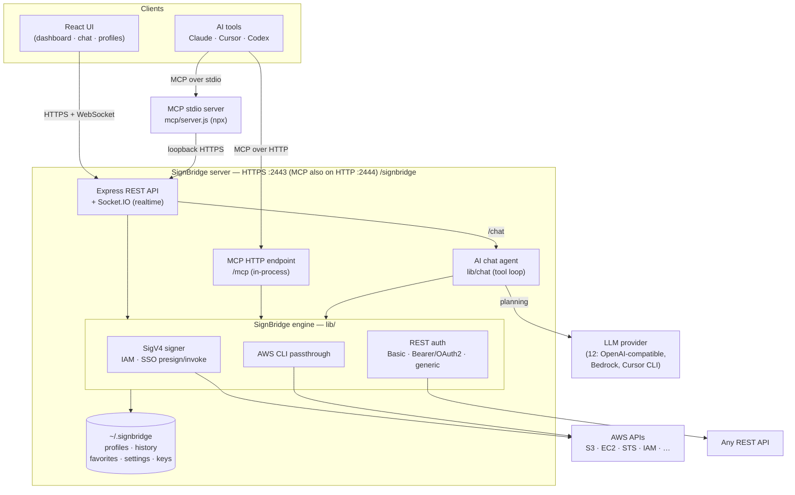

<details>
<summary><b>One presign/invoke request, end to end</b></summary>

The dashboard, the chat agent and both MCP transports converge on the same signing
path:

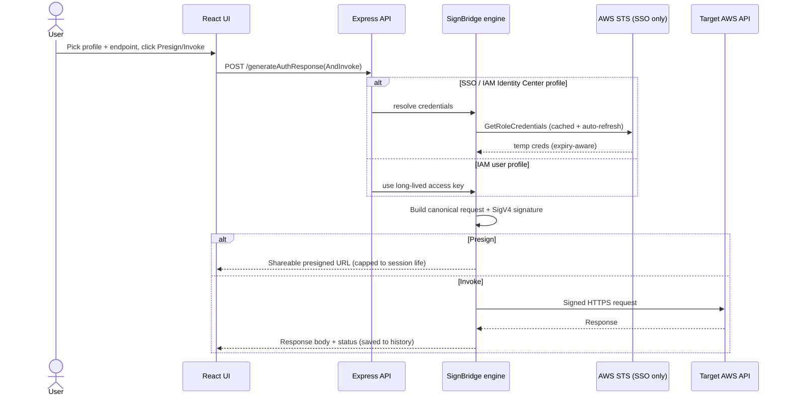

</details>

<details>
<summary><b>Project layout</b></summary>

```
signbridge/
├── server.js              # Express + HTTPS + Socket.IO + in-process MCP HTTP
├── config.properties      # The only config file, tracked with working defaults —
│                          #   nothing to copy, and there is no .env.
├── frontend/              # React UI (Vite + Bootstrap + Cloudscape)
│   ├── src/data/          # comparison.mjs — the "How SignBridge compares" data,
│   │                      #   single-sourced: the README block above is generated from it
│   └── dist/              # Production build served by Express
├── lib/                   # SignBridge signing engine (AWS, SSO, EC2, IRSA, REST)
│   ├── authnModes.js      # The auth-mode registry — one row per profile type
│   ├── credentialProvider.js  # The single credential-resolution dispatch
│   ├── ec2Utils.js        # EC2 instance role over SSH + IMDSv2
│   ├── irsaUtils.js       # EKS IRSA: EKS token, service accounts, AssumeRoleWithWebIdentity
│   ├── logger.js          # The only writer of log output: levels, redaction, stderr for warn/error
│   ├── netGuard.js        # Who can reach the origin: bind host, Host allowlist, security headers
│   ├── pathSafety.js      # assertSafeSegment / resolveWithin — request values that become paths
│   ├── redact.js          # The one place that decides what must not reach a log line
│   ├── chat/              # agent.js (tool loop), chatService.js, llmClient.js, threadStore.js,
│   │                      #   cursorAgent.js (Cursor CLI backend over MCP)
│   ├── llm/               # providers.js (12-provider registry), llmSettings.js, secretStore.js (AES-256-GCM),
│   │                      #   providerClient.js, bedrockConverse.js, modelCatalog.js, llmService.js
│   ├── sandbox/           # Sandbox mode: runner (Docker), runtimes, completions, diagnostics
│   └── s3/                # S3 World: client, signing, content-type resolution, previews, search
├── mcp/                   # MCP server: tools.mjs (shared tool set), server.js (stdio),
│                          #   mcpHttp.mjs (in-process HTTP), README.md (the npm package page)
├── sandbox/               # Dockerfile + build script for the code-execution image
├── scripts/               # generate-certs.sh, generate-brand-assets.sh,
│                          #   gen-comparison.mjs, botocore-to-collection.mjs
├── test/                  # node:test suite (no extra deps): npm test
└── docker-compose.yml

# Runtime state (NOT in the repo):
~/.signbridge/           # per-user artifacts + auto-generated TLS certs
```

</details>

<details>
<summary><b>API routes (all under <code>/signbridge/</code>)</b></summary>

| Route | Purpose |
| --- | --- |
| `POST /generateAuthResponse` | Presign URL |
| `POST /generateAuthResponseAndInvoke` | Signed invoke (IAM keys, SSO, EC2 instance role, IRSA) |
| `POST /generateAuthResponseAndInvokeRestBasicAuth` | REST Basic Auth invoke |
| `POST /generateAuthResponseAndInvokeRestBearerToken` | REST Bearer token invoke |
| `POST /generateAuthResponseAndInvokeGeneric` | Unsigned invoke |
| `POST /testBearerTokenConnection` | Test a Bearer/OAuth2 config |
| `POST /testEc2Connection` | SSH + IMDSv2 check for an EC2 instance-role profile |
| `POST /listIrsaClusters` · `/listIrsaServiceAccounts` | EKS clusters; IRSA-annotated service accounts (no kubectl) |
| `POST /describeIrsaRole` · `/testIrsaConnection` | Read a role's trust policy; run the full token → STS exchange |
| `POST /populateProfilesDetails` | List profiles |
| `POST /chat` | AI chat turn (streams via Socket.IO; needs a provider configured in Settings) |
| `POST /chatThreads` · `/chatThread` · `/chatNewThread` · `/chatRenameThread` · `/chatSummarizeThread` · `/chatDeleteThread` | Chat session management |
| `POST /llmProviders` · `/llmSettings` · `/updateLlmSettings` | LLM provider registry; current config (keys masked); save config |
| `POST /testLlmConnection` · `/listLlmModels` · `/selectLlmModel` · `/deleteLlmKey` | Verify a key; list the models it can reach; choose one; forget a key |
| `POST /populateHistoryDetails` | History list + Socket.IO updates |
| `POST /populateFavoriteDetails` | Favorites |
| `POST /importCollection` | Postman-style templates |
| `POST /invokeCommand` | AWS CLI invocation mode |
| `POST /sandboxRuntimes` | Sandbox languages, limits + Docker readiness |
| `POST /sandboxTemplate` · `/sandboxCompletions` | Starter code; AWS autocomplete index |
| `POST /runSandbox` · `/checkSandbox` · `/cancelSandbox` | Run / syntax-check / stop sandbox code |
| `POST /listSandboxScripts` · `/getSandboxScript` · `/saveSandboxScript` · `/deleteSandboxScript` | Saved sandbox scripts |
| `POST /s3ListBuckets` · `/s3BucketRegion` · `/s3ListObjects` · `/s3HeadObject` | S3 World browsing |
| `POST /s3PreviewObject` · `/s3PresignView` | Decode an object's contents; presign it for a new tab |
| `POST /s3SearchObjects` · `/s3CancelSearch` · `/s3ExplainSearch` | Recursive search: run, cancel, explain the parsed query |
| `POST /s3CreateFolder` · `/s3DeleteObjects` · `/s3CopyObjects` | Create folder, delete (batched), copy/move |
| `GET /s3Object` · `PUT /s3UploadObject` | Stream an object (download/``/`<video>` source); upload a raw body |

</details>

## Testing

```bash
npm test    # node:test, no extra dependencies — seconds, not minutes
```

The suite targets the sharp edges rather than coverage numbers: the SigV4
primitives against AWS's published test vector, the presigned-URL lifetime logic,
the no-login invariant, the search grammar and every S3 preview decoder, the
EC2/IRSA credential paths (pure — no SSH, EKS or STS), Sandbox's isolation argv and
diagnostics parsing, and MCP/dashboard parity.

**Roughly half of it reads source rather than calling it, and that is the point.** A
missing redaction, a world-readable key file, an MCP tool that gained a credential
parameter, an ESM-only dependency that only fails inside the image, a lockfile out
of step with its manifest — each keeps working perfectly while it is wrong, so there
is no behaviour to assert on. If you add a check of that kind, **strip comments
first**: these modules document their own rules in prose, and a naive regex matches
the sentence describing the rule.

## Security

SignBridge is a **local developer tool** — it has no login, and anyone who can
reach its port on your machine can use your AWS profiles. The safe default is
loopback only. See [SECURITY.md](SECURITY.md) for the threat model, MCP notes,
and how to report issues.

## Contributing

See [CONTRIBUTING.md](CONTRIBUTING.md).

## License

[MIT](LICENSE)
