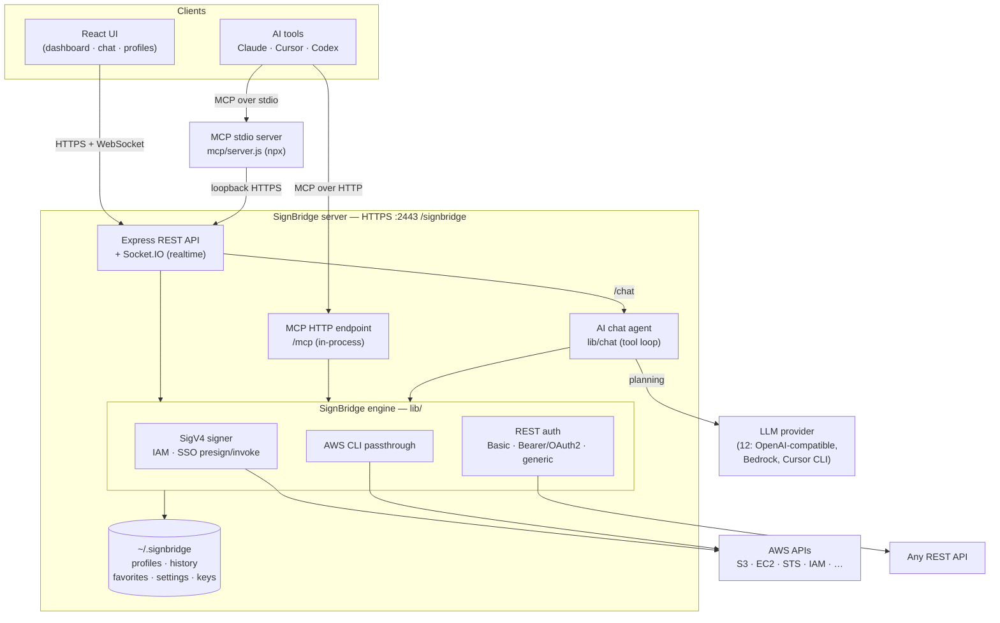
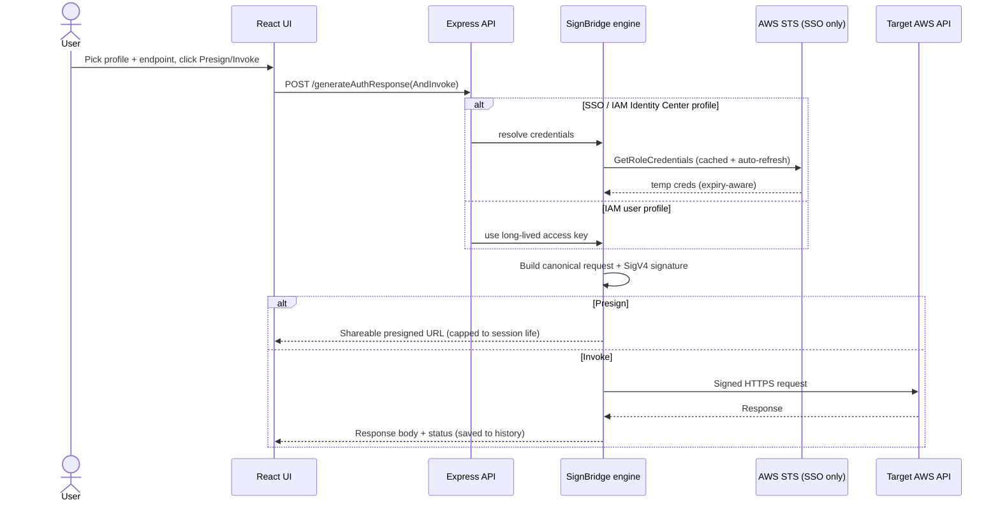

<p align="center">
  <!-- The PNGs, not the SVGs: the mark is a photograph embedded as a data URI,
       and GitHub sanitises the SVGs it serves. The PNGs are rasterised from
       those same SVGs, so they cannot drift. -->
  <picture>
    <source media="(prefers-color-scheme: dark)" srcset="assets/signbridge-wordmark-dark.png" />
    
  </picture>
</p>

<p align="center">
  
</p>

SignBridge is a self-hosted "Postman for AWS SigV4." Its **SignBridge** engine
signs requests with AWS Signature Version 4 using any of four credential sources —
your IAM keys, AWS SSO / IAM Identity Center profiles, an EC2 instance's own
attached role, or an EKS IRSA service-account role — generates presigned URLs for
any AWS API (not just S3), and can also call plain REST APIs with Basic Auth,
Bearer tokens, or no auth at all. It ships with a React UI, an AI chat copilot, and an MCP server for IDE
integration (Claude, Cursor, Codex).

> **TL;DR** — `docker compose up --build -d`, open
> **https://localhost:2443/signbridge/dashboard**, and you're signing AWS
> requests with your existing `~/.aws` profiles. No account, no cloud, no login.

### What you can do with it

- 🔏 **Presign any AWS API** — not just S3. Produce a shareable, time-boxed URL for
  EC2, STS, IAM, S3, and more.
- 🚀 **Invoke live requests** — SigV4 (IAM keys, SSO, EC2 instance role, IRSA),
  REST Basic/Bearer/OAuth2, or unsigned generic — and see the response inline.
- 🌉 **Bridge IAM & SSO** — AWS SSO / IAM Identity Center is a first-class signing
  identity, with automatic STS credential refresh and expiry-aware presigning.
- 🖥️ **Borrow an EC2 box's instance role** — point a profile at a host you can SSH
  into and SignBridge reads its role credentials over IMDSv2. Sign as that instance
  without copying a key anywhere.
- ☸️ **Sign as an EKS IRSA role** — pick a cluster, pick a service account, and
  SignBridge mints its projected token and exchanges it for the annotated role.
  **No `kubectl`, no `aws eks update-kubeconfig`, nothing installed locally.**
- 🧪 **Sandbox mode — write code, press Run** — a real editor (Python, JavaScript,
  TypeScript, Java) with AWS-aware autocomplete, inline error diagnostics, and
  quick fixes. Your code runs in a throwaway container that already has the SDKs
  and your selected profile's credentials. Nothing to install locally.
- 🪣 **S3 World — browse buckets *and see inside the objects*** — drill through
  prefixes like the console, then open a parquet file as a table, an `.xlsx` as
  sheets, a `.log.gz` as text, a `.tar.gz` as a file list, a notebook as cells.
  No download, no context switch. Plus a recursive, case-insensitive,
  match-anywhere search the console does not have.
- 🤖 **Chat copilot (on by default)** — a tool-calling agent that drives the same
  actions in plain English. **Bring your own LLM**: connect OpenAI, Claude,
  Claude on AWS Bedrock, Gemini, OpenRouter, Groq, Mistral, DeepSeek, xAI, Azure
  or a local Ollama from the Settings page — paste a key you have, or follow the
  provider link, create one, and paste it. Keys are encrypted at rest; the model
  is switchable mid-conversation.
- 🧩 **MCP server** — expose every action to Claude, Cursor, and Codex over stdio
  **or** HTTP.
- 📦 **Self-hostable & air-gappable** — file-based storage under `~/.signbridge`,
  runs entirely on your machine.

## What this is

| Layer | Technology |
| --- | --- |
| UI | React 18 + Bootstrap nav + Cloudscape forms |
| Realtime | Socket.IO |
| API | Express HTTPS on port 2443 under `/signbridge/` |
| Auth | None — runs as a single local user, no login |
| AWS | IAM keys, SSO profiles, EC2 instance roles (SSH + IMDSv2), EKS IRSA (no kubectl), SigV4 presign/invoke, AWS CLI mode |
| REST | Basic Auth, Bearer token (static or OAuth2), generic unsigned |
| Sandbox | Monaco editor + Python / JS / TS / Java run in a throwaway Docker container |
| S3 World | Bucket browser + recursive search + in-browser object viewers (parquet, xlsx, docx, archives, notebooks, media, PDF, …) |
| AI Chat | Multi-turn tool-calling agent, **on by default**; 12 LLM providers configured in-app, keys encrypted at rest |
| MCP | stdio server **and** in-process HTTP endpoint — full dashboard parity |
| Storage | File-based, under `~/.signbridge/` (artifacts + TLS certs; LLM keys sealed with AES-256-GCM) |

<!-- BEGIN:COMPARISON (generated from frontend/src/data/comparison.mjs) -->

## How SignBridge compares

No single tool combines everything SignBridge does. Plenty of tools do pieces of it — sign a request, run one from the CLI, proxy it — but the specific bundle of a self-hostable UI that presigns and invokes arbitrary AWS SigV4 APIs, treats AWS SSO / IAM Identity Center as a first-class signing identity, and layers generic REST, AI chat, and MCP on top does not exist as one product. The closest alternatives each miss at least one of these pillars.

| Capability | **SignBridge** | Postman | awscurl | aws-sigv4-proxy | AWS CLI / boto3 | Insomnia / Bruno / Hoppscotch |
| --- | --- | --- | --- | --- | --- | --- |
| Presign URLs (shareable) | ✅ | ⚠️ | ❌ | ❌ | ⚠️ | ⚠️ |
| Invoke live requests | ✅ | ✅ | ✅ | ✅ | ✅ | ✅ |
| SigV4 for any AWS service (beyond S3) | ✅ | ✅ | ✅ | ✅ | ✅ | ⚠️ |
| AWS SSO / IAM Identity Center as signing identity | ✅ | ❌ | ❌ | ⚠️ | ✅ | ❌ |
| Sign as a remote EC2 instance role or EKS IRSA role | ✅ | ❌ | ⚠️ | ⚠️ | ⚠️ | ❌ |
| Auto session refresh + expiry-aware presign | ✅ | ❌ | ❌ | ⚠️ | ❌ | ❌ |
| Graphical UI | ✅ | ✅ | ❌ | ❌ | ❌ | ✅ |
| Generic / non-AWS REST (Basic, Bearer) | ✅ | ✅ | ❌ | ❌ | ❌ | ✅ |
| Self-hostable / air-gappable | ✅ | ⚠️ | ✅ | ✅ | ✅ | ⚠️ |
| Browse S3 and view object contents in-browser | ✅ | ❌ | ❌ | ❌ | ⚠️ | ❌ |
| MCP server (AI / IDE integration) | ✅ | ⚠️ | ❌ | ❌ | ❌ | ⚠️ |

Legend: ✅ full · ⚠️ partial / indirect · ❌ not supported.

### Where SignBridge stands out

- **SSO / IAM Identity Center as a first-class signing identity.** Most REST clients only handle static IAM access keys. On SSO you would otherwise run `aws sso login`, copy the temporary access key, secret, and session token by hand, and repeat every time the session rolls. SignBridge reads ~/.aws, performs the STS GetRoleCredentials exchange, caches and auto-refreshes, and caps a presigned URL's expiry to the session's real remaining life — so it never advertises an hour it cannot honor.
- **Signing as an EC2 instance role or an EKS IRSA role, from your own machine.** Every other tool here can use an instance role or an IRSA role only when it is already running on that instance or inside that pod — which is why debugging "works locally, AccessDenied in the pod" means SSHing in or exec'ing into a container. SignBridge makes both of them ordinary profiles: point one at a host you can SSH into and it reads the role over IMDSv2; pick a cluster and a service account and it mints that account's projected token and exchanges it via AssumeRoleWithWebIdentity. No kubectl, no kubeconfig, nothing installed — and the resulting credentials presign and invoke exactly like any other profile.
- **Presigning for arbitrary AWS APIs, not just S3.** The AWS SDKs only expose presigners for a handful of services. SignBridge presigns any SigV4 endpoint (EC2 DescribeInstances, STS, and more) and hands you a shareable URL. Tools like awscurl and aws-sigv4-proxy can only invoke — they never produce a URL you can pass on.
- **S3 World: seeing inside an object, not just listing it.** AWS's Storage Browser for Amazon S3 and the open-source explorers (aws-js-s3-explorer, aws-s3-bucket-browser, and friends) give you a polished folder view and bulk operations — and then stop at download. S3 World browses the same way, but resolves what an object actually is (extension, stored type, magic bytes) and renders it: parquet as a table, an .xlsx as sheets, a .log.gz as text, a tarball as a member list, a notebook as cells. Its search is recursive, case-insensitive, and matches anywhere in the key, where the console's is a case-sensitive single-level prefix filter.
- **One self-hostable UI over the whole workflow.** Presign, invoke, AWS CLI passthrough, generic REST, history, favorites, templates, and an MCP server so Cursor / Claude can drive it — all behind a single UI you run yourself, with file-based artifacts under your control. Postman is the only tool with comparable surface area, but it is cloud-first, has no SSO signing, and no MCP-into-AWS bridge.

### Honest caveats

- Postman is the real surface-area competitor. If you already live in Postman with static IAM keys, SignBridge's wedge is specifically SSO-native signing, self-hosting, correct expiry semantics, and MCP.
- The invoke and CLI-passthrough pieces are commoditized (awscurl, aws-sigv4-proxy, the AWS CLI itself). Those are table stakes SignBridge bundles in — the signing + bridging is the unique part.
- For plain S3 browsing, uploads, and bulk operations, the AWS console and Storage Browser for Amazon S3 are perfectly good and better integrated with IAM. S3 World's wedge is viewing an object's contents without downloading it, and a search that finds a key by any part of its name.

<!-- END:COMPARISON -->

## Architecture

One `node server.js` process (or one container) serves everything on HTTPS port
2443: the React UI, the REST API, the realtime Socket.IO channel, **and** the MCP
HTTP endpoint. The **SignBridge** engine in `lib/` does the actual SigV4 signing;
the AI chat agent and both MCP transports are just alternative front-doors onto
the *same* set of actions.



**One presign/invoke request, end to end** — the dashboard, the chat agent, and
both MCP transports all converge on the same signing path:



## Quick start

The fastest path is Docker — you don't need Node, npm, or the AWS CLI installed
locally, and your `~/.aws` profiles are picked up automatically.

### 1. Prerequisites

- **Docker** (with Docker Compose) — the only hard requirement.
- **AWS credentials in `~/.aws`** (optional but typical): an IAM `credentials`
  file and/or SSO profiles in `config`. For SSO, run
  `aws sso login --profile <name>` on the host first.
- **An LLM API key** (optional): only for the AI chat copilot — and you add it
  in the app, not here. See [Bring your own LLM](#bring-your-own-llm--configured-in-the-app-not-in-a-file).

Nothing else to install. The Sandbox execution image is built for you as part of
`docker compose up` — see [Sandbox mode](#sandbox-mode).

### 2. Configure

```bash
cp config.properties.example config.properties   # local config (gitignored)
```

That's the whole of it. The file works as-is with sensible defaults, and **it
holds no API key** — there is deliberately no `.env` file either, and no
environment variable that supplies one. If you want the AI chat, you connect a
provider and add its key in the running app — Settings → AI features — which
verifies the key and stores it encrypted. See
[Bring your own LLM](#bring-your-own-llm--configured-in-the-app-not-in-a-file).

### 3. Run

```bash
docker compose up --build -d
```

Then open **https://localhost:2443/signbridge/dashboard** and accept the
self-signed certificate (expected for local HTTPS).

> Prefer a helper script? `./launchSignBridge start` builds the image and runs
> the container, wiring up the `~/.aws` and `~/.signbridge` mounts for you.
> `./launchSignBridge stop` / `delete` manage its lifecycle.

### 4. First run checklist

1. **Dashboard loads** at `/signbridge/dashboard` — no login, you're in.
2. **Your AWS profiles appear** on the **Profiles** page (auto-imported from
   `~/.aws`). Add IAM/SSO/REST profiles here too.
3. **Presign or invoke** — pick a profile + auth mode, enter an endpoint, and
   click **Presign** (get a URL) or **Invoke** (get a live response).
4. **(Optional) Chat** — needs an AI provider key of your own, which you add in
   **Settings → AI features**: enable it, pick a provider, paste its key (or, for
   AWS Bedrock, sign with an AWS profile you already have) and pick a model. Then
   open the **Chat** page and ask *"list my profiles"* or *"presign a GetObject for
   bucket X, valid 1 hour."* Open Chat before doing that and it tells you exactly
   this, with a link to the page.

**No login.** The app runs as a single local user (`signbridgeuser`) — there
is no sign-in flow. See [User identity](#user-identity) to change the name.

### Running locally without Docker

```bash
npm install
cd frontend && npm install && npm run build && cd ..   # build the UI (required)
npm start                                               # node server.js on :2443
```

`server.js` refuses to start if `frontend/dist` is missing, so build the UI
first. Configuration comes from `config.properties`; the few environment
overrides (see [Configuration](#configuration)) are read straight from the
process, so set them on the command line — `LOG_LEVEL=debug npm start` — rather
than in a file.

By default the server binds **127.0.0.1**, so it is reachable from this machine
only. That is the intended posture: there is no login, and anything that can
reach the port can sign with your AWS credentials.

### TLS certificates

The app serves HTTPS. On first run it **auto-generates** a self-signed
certificate into `~/.signbridge/keys/` — no manual step needed.
Your browser will warn about the self-signed cert; that's expected for local use.

To regenerate manually (e.g. after expiry), delete the pair and restart, or run:

```bash
./scripts/generate-certs.sh
```

## User identity

SignBridge has no authentication. Every request runs as one local user, and
per-user artifacts (profiles, history, favorites) are stored under that name. To
change it, edit the `[auth]` section:

```properties
[auth]
defaultUserName=signbridgeuser
defaultDisplayName=SignBridge User
defaultEmail=signbridgeuser@localhost
```

## AWS credentials

Mount your local `~/.aws` (see `docker-compose.yml`):

- `config` — SSO profile definitions
- `credentials` — IAM user keys
- `sso/` — SSO cache (run `aws sso login --profile <name>` on the host first)

Profiles auto-import to `~/.signbridge/artifacts/userartifacts/signbridgeuser/profiles/`.

`ec2_instance` and `irsa` profiles need nothing in `~/.aws` of their own — an EC2
profile reaches its credentials over SSH, and an IRSA profile borrows an existing
SSO/IAM profile only to reach EKS. See
[Profiles & auth modes](#profiles--auth-modes).

## Runtime files

All runtime state lives under a single, fixed base directory in your home —
nothing is written inside the project:

```
~/.signbridge/
├── artifacts/
│   └── userartifacts/{userName}/   # profiles, history, favorites, collections, settings
└── keys/                           # auto-generated self-signed TLS cert + key
```

This location is **fixed at `~/.signbridge` and not configurable** — everything
in one predictable, hidden home directory. In Docker it's a host mount, so your
profiles and certs persist across container rebuilds.

## Configuration

`config.properties` is the only config file, and **there is no `.env`** — no
`dotenv` dependency, and nothing to copy but the one template. It is INI-style,
read as `section.key`, and every section is commented in
`config.properties.example`:

| Section | What it holds |
| --- | --- |
| `[server]` | `PORT` (2443), `bindHost`, `allowedHosts`, and the *names* of the sub-directories under each user's artifacts dir |
| `[logging]` | `level` — `error` \| `warn` \| `info` \| `debug` |
| `[ssl]` | The cert/key file names under `~/.signbridge/keys` |
| `[auth]` | The single local user's name, display name and email |
| `[app]` | Route prefix, branding, and the auth-mode display labels |
| `[llm]` | The behavioural knobs only — `enabled`, `reasoningEffort`, `temperature`, `maxToolIterations`. **No key, no provider, no model:** those are chosen in the app |
| `[cursor]` | Only for the Cursor AI provider: CLI binary, timeouts, output cap |
| `[sandbox]` | Execution image, Docker binary, timeouts, memory/CPU/pids caps |
| `[awscatalog]` | The botocore service-model source used by Templates and Sandbox completions |

### Network exposure

SignBridge has no login and can sign with every AWS profile on the machine, so
**the address it binds is the whole of its access control**:

- `bindHost` defaults to **`127.0.0.1`** — reachable from this machine only. Set
  it to `0.0.0.0` outside a container and you have published an unauthenticated
  API that spends your AWS credentials to anyone who can reach the port. The
  server logs a warning when it does.
- In Docker, `BIND_HOST=0.0.0.0` is set for you — a container process has to bind
  its own interfaces to be reachable through a published port at all. Compose then
  publishes that port **to `127.0.0.1` on the host**, so the container isn't on the
  network either. Change `BIND_ADDRESS` in `docker-compose.yml` if you genuinely
  want it exposed.
- `allowedHosts` is the DNS-rebinding guard: loopback names are always accepted,
  any other `Host` header is refused with `421`. Add a name only if you actually
  serve SignBridge under it (`allowedHosts=signbridge.internal,192.168.1.50:2443`).

One thing to know before you expose it anywhere: the profile forms carry AWS
secret keys and SSH private keys in the browser, because that is what editing a
profile means. Keep it on loopback.

### Logging

All output goes through `lib/logger.js` — levelled, `warn`/`error` on stderr, and
**every value passed through `lib/redact.js` first**, so no log line at any level
carries a secret access key, session token, bearer token or provider API key.
`docker logs` is the artifact people paste into an issue; it has to be safe to
paste.

`level=debug` prints the full signing trace per request (canonical request,
canonical headers, string-to-sign, resolved profile, AWS/SSO response bodies) —
the only practical way to debug a SigV4 mismatch, and hundreds of lines per
request. Turn it on for one run:

```bash
LOG_LEVEL=debug npm start          # local
```

In Docker, set `level=debug` in `config.properties` (bind-mounted, so it survives
rebuilds) or add `LOG_LEVEL: debug` to the `environment:` block in
`docker-compose.yml`, then `docker compose up -d`.

### Environment variables

Everything has a `config.properties` home or a sensible default; these exist for
unattended deploys that can only set environment variables. They're read from the
process, so pass them on the command line or in `docker-compose.yml` —
there is no file for them.

| Variable | Overrides |
| --- | --- |
| `BIND_HOST` | `server.bindHost` |
| `LOG_LEVEL` | `logging.level` |
| `LLM_ENABLED` | `llm.enabled` (the operator master switch — it can only turn AI features off) |
| `USER_NAME` | `auth.defaultUserName` |
| `CURSOR_CLI_BIN` | `cursor.cliBin` |
| `SANDBOX_IMAGE`, `SANDBOX_DOCKER_BIN` | `sandbox.image`, `sandbox.dockerBin` |
| `SANDBOX_HOST_BASE_DIR` | The host path `~/.signbridge` is mounted from — required only when SignBridge itself runs in a container |
| `TIMEOUT` | Outbound HTTP request timeout (ms) |
| `SSO_CREDENTIAL_REFRESH_BUFFER_MS`, `EC2_CREDENTIAL_REFRESH_BUFFER_MS`, `IRSA_CREDENTIAL_REFRESH_BUFFER_MS` | How much life a cached temporary credential must have left to be reused (default 5 min) |

**No variable here carries a secret, and there is no variable that can supply an AI
provider key.** A provider key is entered in **Settings → AI features**, where
SignBridge verifies it and stores it encrypted under `~/.signbridge`. That is the
only path: a key in an environment variable cannot be verified, masked or rotated
by the app, and it leaks into process listings, shell history and whatever
orchestrator template set it. `LLM_ENABLED=false` turns AI features off; nothing
turns them on without a key you added in the UI.

`HTTPS_PORT` and `BIND_ADDRESS` are read by **Compose and `launchSignBridge`**, not
by the app: they set the host side of the published port. The server always
listens on `server.PORT` inside the container.

`SIGNBRIDGE_API_BASE` and `SIGNBRIDGE_USER` belong to the **stdio MCP client's**
process, not to the server — see [MCP Server](#mcp-server).

## Profiles & auth modes

Create profiles on the **Profiles** page. Each profile declares one or more
authentication mechanisms:

| Mode | Description |
| --- | --- |
| `sso_user` | AWS SSO / IAM Identity Center — SigV4 |
| `iam_user` | IAM access key/secret — SigV4 |
| `ec2_instance` | An EC2 instance's attached role, read over SSH + IMDSv2 — SigV4 |
| `irsa` | An EKS IRSA service-account role, via `AssumeRoleWithWebIdentity` — SigV4 |
| `rest_basic_auth` | HTTP Basic Auth (username + password) |
| `rest_bearer_token` | Bearer token — static, or fetched via OAuth2 |
| `generic` | Plain request, no signing |

### EC2 instance role (`ec2_instance`)

Sometimes the credentials you need are not on your laptop at all — they are the
role attached to an EC2 box. The usual workaround is to SSH in, `curl` IMDS by
hand, and paste three values into a shell. An `ec2_instance` profile does that
for you, on every signing operation.

Fill in the host you can already reach:

| Field | Notes |
| --- | --- |
| **EC2 host** | Public/private IP **or** DNS hostname |
| **SSH username** | e.g. `ec2-user`, `ubuntu` |
| **SSH port** | Defaults to `22` |
| **SSH private key** | Paste it, or **drop the `.pem` file** on the field — plus an optional passphrase |
| **SSH password** | The alternative to a key |

The key and the password are a **radio choice, not two optional boxes**: the form
lets you supply exactly one, so "which did I mean?" is never a question the
backend has to guess at. Saving the profile also **tests the connection** — you
get the instance id, its region and the attached role name back on success, and
the real SSH failure (`Permission denied (publickey)`, timeout, DNS) on failure,
rather than a profile that silently doesn't work until you first try to sign
with it. **Test connection** re-runs it any time.

Under the hood SignBridge opens an SSH session (via the `ssh2` library — no
system `ssh`, no shelling out) and walks IMDSv**2**: `PUT /latest/api/token`
with a 6-hour TTL, then the identity document, then
`/latest/meta-data/iam/security-credentials/<role>`. The token step is not
optional — IMDSv1 is disabled on any instance configured `HttpTokens=required`,
which is now the default for new launch templates.

What comes back is the same `{ accessKeyId, secretAccessKey, sessionToken,
expiration }` shape an SSO profile produces, so presigning, invoking, "Copy as
curl", AWS CLI mode, Sandbox mode and S3 World all work with no special cases.
Credentials are cached on the profile and re-read when they are within 5 minutes
of expiry; anything shown back to you is **masked** (`ASIA****1234`), and the
secret is never logged or persisted in the clear.

### EKS IRSA (`irsa`)

IRSA (IAM Roles for Service Accounts) is how a pod gets an AWS role: the service
account is annotated with `eks.amazonaws.com/role-arn`, the pod gets a projected
OIDC token, and it exchanges that for the role. An `irsa` profile lets *you* sign
as that same role — which is exactly what you want when debugging "it works from
my laptop but the pod gets AccessDenied".

> **`kubectl` is not required.** Nor is `aws eks update-kubeconfig`, a kubeconfig
> file, or anything else installed locally or in the container. SignBridge talks
> to the EKS Kubernetes API directly, authenticating with an EKS-style
> `k8s-aws-v1.<presigned STS GetCallerIdentity URL>` token — the same token
> `aws eks get-token` produces, built in-process.

You pick, in this order — each step populated from the one before, so there is
nothing to look up or paste:

1. **Base AWS profile** — an ordinary `sso_user` or `iam_user` profile. It is used
   *only* to reach EKS and read the role; it is not what signs your requests.
   (EC2 and IRSA profiles are deliberately not offered as a base — no chaining.)
2. **Region** — defaults to `us-east-1`, changeable.
3. **Cluster** — from `eks:ListClusters`.
4. **Service account** — every service account in the cluster carrying the
   `eks.amazonaws.com/role-arn` annotation, with the role it points at.
5. **The role's trust policy is read, not assumed** — `iam:GetRole` gives the
   `AssumeRolePolicyDocument`, and SignBridge pulls the required audience out of
   its `:aud` condition and tells you whether *this* service account's subject
   (`system:serviceaccount:<ns>:<name>`) is actually trusted. If `iam:GetRole` is
   denied, that is a note rather than a blocker: the audience defaults to
   `sts.amazonaws.com` and the assume is attempted anyway.

Then **Test connection** runs the real thing end to end: mint the service
account's token (`POST .../serviceaccounts/<name>/token`) and exchange it via
`sts:AssumeRoleWithWebIdentity`, reporting the assumed-role ARN. From then on
every signing operation does the same, transparently.

The base profile's own IAM identity needs `eks:ListClusters`,
`eks:DescribeCluster` and (ideally) `iam:GetRole`, **and** it must be mapped in
the cluster's access entries / `aws-auth` ConfigMap. A cluster with a
private-only endpoint requires SignBridge to be running inside the VPC or on the
VPN, and it says that too.

Two *different* Kubernetes RBAC permissions are involved, and it is normal to
have the first without the second — read-only cluster roles such as `view` grant
listing but not token creation:

| Step | Kubernetes permission |
| --- | --- |
| Load service accounts | `list` / `get` on `serviceaccounts` |
| Test connection, and every signing operation | `create` on the **`serviceaccounts/token`** subresource, in that namespace |

So a cluster where the dropdown fills in happily but **Test connection** returns
`403 … cannot create resource "serviceaccounts/token"` is not an AWS IAM or
access-entry problem — the identity is already mapped. SignBridge's error says
exactly that, names the namespace, and quotes the rule to grant:

```yaml
# Role in the service account's namespace, bound to your identity with a RoleBinding.
rules:
  - apiGroups: [""]
    resources: ["serviceaccounts/token"]
    verbs: ["create"]
    resourceNames: ["my-service-account"]   # optional, to narrow it
```

### A note on AWS CLI mode with EC2 and IRSA profiles

In **CLI** invocation mode, `ec2_instance` and `irsa` credentials are handed to
the AWS CLI through the environment (`AWS_ACCESS_KEY_ID` / `AWS_SECRET_ACCESS_KEY`
/ `AWS_SESSION_TOKEN`). So **do not put `--profile` in the command** — a named
profile makes the CLI ignore the environment and read `~/.aws/config` instead,
which produces a confusing "profile not found" or, worse, signs as the wrong
identity.

### Bearer Token (static or OAuth2)

Bearer Token profiles support two sources:

- **Static token** — paste a token; it is sent as `Authorization: Bearer <token>`.
- **OAuth2 fetch** — SignBridge fetches a token at invoke time from your
  token endpoint. Supports `client_credentials` and `password` grant types.
  Because providers differ, the request form fields are **fully customizable**:
  add, remove, and edit key/value pairs (e.g. `client_id`, `client_secret`,
  `audience`, `connection`, `scope`).

**"Token to use" is detected, not guessed.** Rather than picking a token blindly,
the form reveals the **Token to use** selector only *after* you click **Test
Connection**. The live token response is inspected and the right field is
recommended — `access_token` for `client_credentials`, `id_token` for `password`
(falling back to `access_token`). If the expected token isn't in the response,
the test fails with a clear error instead of silently choosing the wrong one.
Editing any token-fetch field re-arms the test, so the selector hides until you
re-test.

**Automatically renew the token on expiry** — a checkbox on OAuth2 profiles. A
token that passed Test Connection can still expire before you invoke. With this
box checked, an expired token is silently re-fetched at invoke time; unchecked,
an expired token produces a clear error asking you to enable auto-renew or
re-test. This applies to invokes from the dashboard, the AI chat, and MCP alike.
Tokens are cached in memory per profile (never persisted) and refreshed based on
JWT `exp` / `expires_in`.

## AI Chat

The chat copilot is a **multi-turn, tool-calling agent** — not a one-shot planner.
It runs a `model → tools → model` loop over the *same* tool set the dashboard and
MCP server expose (presign, invoke, list/search profiles, history, favorites,
collections, AWS CLI passthrough, …), so it can chain steps on its own: e.g.
*"re-run my last request and tell me what failed"* → it calls `list_history`,
reads the result, invokes the endpoint, then explains the response. Answers stream
token-by-token over Socket.IO, with live tool-call chips and a Stop button.

**Chat history.** The dedicated **Chat** page (ChatGPT/Cursor style) has a
left-hand sidebar listing your prior sessions — click one to reopen its full
transcript or start a New chat. **Right-click any session** (or use its `⋯`
button) for **Rename**, **Summarize**, and **Delete** — each in a themed dialog,
no jarring browser pop-ups. *Summarize* asks the AI for a short recap of what the
session did (requests, profiles, outcomes). Conversations are remembered
server-side per thread, so follow-ups keep context. Links in chat answers (SSO
authorize links, presigned URLs) open in a new browser tab so they never disturb
your session.

**Presign vs. invoke.** *Presigning* only builds a signed URL — it doesn't call
the API, so there's no live response to summarize (and for SSO profiles the URL
stops working once the session expires). Ask to *invoke* (or "re-invoke my last
request and summarize the response") when you want the real response body. AWS
query-protocol services like EC2/IAM/STS return XML; to get JSON, invoke with an
`Accept: application/json` header where the service supports it.

**Presigned URL expiry.** Choose how long a presigned URL stays valid — from the
dashboard's **Presigned URL Expiry** dropdown (15 min up to 12 hours), by asking
the chat (*"presign … valid for 2 hours"*), or via the MCP `presign_url`
`expiresInSeconds` argument (60–43200s, default 3600). **Caveat for AWS SSO
profiles:** the URL embeds temporary session credentials, so its real lifetime is
capped to the SSO session's remaining life (typically ≤ 1 hour from `aws sso
login`) — a longer requested expiry won't extend it. For genuinely long-lived
presigned URLs, use an **IAM-user** profile (long-lived keys). If the SSO session
has expired, presign fails with a clear message telling you to run `aws sso login
--profile <name>` and retry.

**It asks before it acts.** The agent never assumes which profile to use. Unless
you name one in your message, it lists your profiles and asks you to choose via
clickable quick-reply chips; if the chosen profile supports more than one auth
mechanism, it asks which one before presigning or invoking. You can still name a
profile directly — e.g. *"invoke GET https://… using profile qa-eng"* — to skip
the prompt.

### Bring your own LLM — configured in the app, not in a file

**SignBridge ships no AI key of its own, so Chat does nothing until you connect a
provider.** There is no key in `config.properties`, no `.env`, and no environment
variable that can supply one — the key is yours, you add it in the UI at runtime,
and no restart is involved. Until you do, the Chat page says so and links straight
to the page that fixes it, so you never have to guess why a turn failed.

Open **Settings → AI features** and turn on **Enable LLM**:

| Step | What happens |
| --- | --- |
| **1. Pick a provider** | OpenAI, Anthropic (Claude), **AWS Bedrock (Claude)**, OpenRouter, Google Gemini, Cursor, Groq, Mistral, DeepSeek, xAI, Azure OpenAI, or a local **Ollama** (no key at all). |
| **2. Supply a key** | Two options, and the card spells them out: **① paste a key you already have**, or **② open that provider's console** (one click, deep-linked to its API-keys page), create one there, and come back and paste it into ①. Every provider works identically. SignBridge never creates or exchanges a key on your behalf — it is your provider account, your key and your billing. |
| **3. Test the connection** | One click. Success shows the account the key belongs to; failure shows the provider's actual reason — wrong key, no credit, wrong region — not a generic "request failed". |
| **4. Choose a model** | The list is the models **your key can actually reach**, fetched live and filtered to models that can hold a conversation (no embeddings, no TTS, no image models). |

Keys are **encrypted at rest** (AES-256-GCM) under `~/.signbridge`, never written
to `config.properties`, never sent back to the browser, and never exposed to an
MCP client. The Settings page shows a mask like `sk-proj-…••••fDIA`, not the key.

**Switching provider doesn't cost you the last one.** Each provider keeps its own
key, its own verification and its own model list. Connect Anthropic after OpenAI
and the OpenAI key stays stored — going back is one click on the tile, not
re-entering a key. Whichever provider you verified last is the one Chat uses, and
the confirmation says so in as many words (*"Chat now uses Anthropic (Claude)
instead of OpenAI, whose key stays saved"*), so the handover is never silent.

**Claude in your own AWS account — and this is the one provider that needs no key
at all.** The **AWS Bedrock (Claude)** provider reaches Claude through Bedrock's
native **Converse** API (`bedrock-runtime.<region>.amazonaws.com`), so prompts stay
inside your AWS boundary and usage is billed to AWS rather than to Anthropic
directly. Because that call is a signed AWS request, SignBridge can sign it with a
profile you already have here — IAM user, SSO role, EC2 instance role or EKS IRSA
service account — which is the default: pick Bedrock, leave the credential source
on **Sign with an AWS profile**, choose the profile, set the region where your
Claude models are enabled, and press **Save & test**. The role needs
`bedrock:InvokeModel` and `bedrock:InvokeModelWithResponseStream`;
`bedrock:ListFoundationModels` is optional — without it the picker offers a short
list of current Claude models and you can type any other model id you have access
to, which is then remembered. A Bedrock API key is the alternative if you have one.
The two are unrelated credentials and the choice is explicit for that reason:
IAM/SSO/EC2/IRSA profiles sign the AWS calls SignBridge makes *for* you, while a
Bedrock API key only buys inference.

<details>
<summary><b>Cursor works differently — it runs the Cursor agent locally</b></summary>

Cursor sells an **agent**, not model access: there is no chat-completions endpoint
a Cursor key can answer on. So SignBridge takes the other route — it is itself an
MCP server exposing all 58 dashboard tools, and Cursor's agent consumes MCP. Pick
Cursor as your provider and a chat turn runs the **Cursor agent CLI on this
machine**, handed SignBridge's own tools, driving the same API the dashboard uses.

It needs two things besides your key — and the Docker image ships both, so
`docker compose up --build` is enough. For a local `npm start`, install them once:

```bash
curl https://cursor.com/install -fsS | bash   # the CLI, on the machine running SignBridge
cd mcp && npm install                          # SignBridge's MCP dependencies, once
```

**Test connection** reports each of them separately from the key, so you are told
which piece is missing rather than getting one ambiguous failure.

Three things to know before choosing it:

- **The CLI must be on the SignBridge server** — the process that spawns it. The
  image installs it during the build; build with `--build-arg INSTALL_CURSOR_CLI=0`
  (or run `npm start` on a machine without it) and this provider will report itself
  unavailable while every other provider keeps working.
- **The headless agent runs with tool approval forced** (`--force`) — a background
  process has no terminal to answer an approval prompt. That switch also grants it
  shell and file access **in its working directory**, which is why that directory
  is a fresh empty scratch dir per conversation, under your artifacts, containing
  nothing but the generated `.cursor/mcp.json` and `AGENTS.md`. Never your repo,
  never your home directory.
- **MCP servers you have already approved in your own Cursor CLI will also load**
  for these runs. SignBridge approves its own server by name (`agent mcp enable
  signbridge`) rather than using Cursor's blanket `--approve-mcps`, but it cannot
  un-approve what you approved earlier. Undo SignBridge's own with
  `agent mcp disable signbridge`.

Your key never reaches the command line — it is passed in the child process's
environment, so it cannot appear in `ps` output. The agent reaches SignBridge's tools
over its own local MCP endpoint (`https://localhost:2443/signbridge/mcp`), which is
also what keeps it working on a Cursor team that has **MCP Network Controls** turned
on. Settings for this provider live in `config.properties [cursor]` (`cliBin`,
`timeoutSeconds`, `maxConcurrentRunsPerUser`, …), with `CURSOR_CLI_BIN` as the env
override.

</details>

**Switch models mid-conversation.** The Chat page carries a Cursor-style chip
showing the current provider and model; click it for a searchable list of every
model on your key. Picking one applies to the current turn *and* writes back to
Settings, so Chat and Settings can never disagree about which model you are using.

**Turning it off.** `enabled=false` in `config.properties [llm]` (or
`LLM_ENABLED=false`) is an operator-level master switch: with it off, no key
pasted in the UI will turn chat back on.

Tuning that isn't per-provider still lives in `config.properties`:

```properties
[llm]
enabled=true         # on by default; false disables all AI features
reasoningEffort=     # reasoning models (o-series / GPT-5.x): minimal|low|medium|high
temperature=0        # non-reasoning models only
maxToolIterations=8  # safety cap on the tool loop per turn
```

Reasoning models (o-series, GPT-5.x, Claude thinking models, or any id detected as
a reasoning model) automatically use `reasoningEffort` and drop `temperature`;
everything else uses `temperature`.

## Sandbox mode

Presigning a raw SigV4 request is an advanced, occasional need. Writing three
lines of `boto3` is not — it's how most people actually explore an API. **Sandbox
mode** is the third invocation mode (alongside `Rest_Api` and `Cli`): an editor
with a Run button. Choose **Sandbox** in the dashboard's *Invocation Mode* and the
editor opens right there, in place of the request form — just like choosing `Cli`
swaps in the command box — using the profile you already selected above it. It's
also a page of its own at **`/signbridge/sandbox`** if you'd rather start there.

**Languages:** Python (boto3), JavaScript and TypeScript (AWS SDK v3), Java (AWS
SDK v2). Pick one and you get a runnable starter template.

**What makes it an editor and not a text box**

- **AWS-aware autocomplete.** `boto3.` lists boto3's members; a client built from
  `boto3.client('ec2')` lists EC2's real operations, with their parameters, types,
  and documentation — for any of ~429 AWS services, generated from botocore's own
  service models. Method names match the SDK exactly (`describe_vpcs`, not
  `describe_vp_cs`).
- **Real diagnostics.** Errors come from each language's own checker running in the
  container (`py_compile`, `node --check`, `tsc`, `javac`), mapped back to the line
  and column, with a suggested fix on the lightbulb. Runtime errors are mapped the
  same way, so a traceback underlines the offending line.
- **Credential-aware remedies.** An expired SSO session tells you to run
  `aws sso login --profile <name>`; an `AccessDenied` says plainly that it is not a
  code error.
- **Saved scripts.** Keep and re-run scripts; each remembers the profile it ran with.

**How it runs your code**

Your file is written to a fresh per-run workspace, mounted **read-only** at
`/workspace` in a container started from the prebuilt `signbridge-sandbox` image
(all four toolchains + the SDKs, no `pip install` at run time). The container is
`--rm`, drops all capabilities, gets `no-new-privileges`, a capped tmpfs for
scratch, and memory/CPU/PID limits; a syntax check additionally gets
`--network none`. Credentials for the selected profile are passed **by
environment-variable name only**, so no secret ever appears in a command line or
log. The container is destroyed and the workspace deleted when the run ends.

**Setup: none, if you start with Docker.**

`docker compose up` builds the execution image itself — `docker-compose.yml`
declares it as a one-shot `sandbox-image` service that the app waits on
(`service_completed_successfully`). The image's own entrypoint prints the
toolchain versions it contains and exits, so a broken image shows up at `up` time
rather than on your first Run. Later starts reuse the layer cache and add a second
or two. `./launchSignBridge -o start` does the same, building the image only when
it is missing.

The first build downloads toolchains for four languages, so budget several
minutes and a few GB for it once.

To build it by hand instead — running SignBridge locally with `npm start`, or
pinning the Java SDK version:

```bash
npm run build:sandbox            # builds signbridge-sandbox:latest
npm run build:sandbox -- --verify   # …then print what's inside
```

Sandbox mode needs access to a Docker daemon to start those sibling containers.
Running SignBridge locally (`npm start`), that's automatic. Running SignBridge
**in** Docker, `docker-compose.yml` and `launchSignBridge` bind-mount
`/var/run/docker.sock` and set `SANDBOX_HOST_BASE_DIR` for you.

> ⚠️ Mounting the Docker socket is a privileged grant — access to the daemon
> socket is equivalent to root on the host. Sandbox mode is the only feature that
> needs it. To run without it, delete the `docker.sock` volume line from
> `docker-compose.yml` (or start with `SIGNBRIDGE_SANDBOX=0 ./launchSignBridge -o start`).
> Everything else keeps working and the Sandbox page reports Docker as unavailable.

Limits live in the `[sandbox]` section of `config.properties` (timeout, memory,
CPU, PID and output caps, concurrent runs, saved-script count).

## S3 World

The AWS console lets you browse a bucket and download a file. To *look* at that
file you download it, find it, open it in something that understands the format,
and lose your place. **S3 World** removes that round trip: it is a bucket browser
where the answer to "what's in this object?" is a click.

Open **S3 World** in the nav (**`/signbridge/s3world`**) and the flow is:

1. **Pick a profile** — every IAM-user and SSO profile you have, each listing the
   mechanisms it supports, with a filter box for long lists.
2. **Pick a bucket** — paginated, with a search box that matches anywhere in the
   name. Regions are resolved lazily, only for the buckets on screen (an account
   with 500 buckets shouldn't make 500 API calls to draw a list).
3. **Drill down** — prefixes behave like folders, with breadcrumbs, adjustable
   page size, and a *flatten* toggle when you'd rather see every key beneath you
   at once.
4. **Select an object and click View.**

Everything is in the URL — profile, bucket, prefix — so a view is a link you can
bookmark or paste to a colleague.

### Viewing: what each content type does

The single reason "view an S3 object" is normally painful is that you cannot
trust a stored `Content-Type`. Objects written by the CLI, a Spark job, or a
Lambda land as `application/octet-stream`, and a browser handed that downloads
the file. So the type is resolved from the key's extension, the stored type (used
only when it is specific), and the object's leading magic bytes — which cannot
lie — and then the object takes one of two routes:

| Content | How it opens |
| --- | --- |
| Images, PDF, video, audio | **New tab**, rendered natively by the browser, via a short-lived presigned URL |
| Parquet | Decoded server-side → **table**, with the schema |
| CSV / TSV / NDJSON | **Table**, delimiter sniffed |
| JSON | Pretty-printed, collapsible |
| Logs, text, source code (30+ extensions) | Text pane, encoding-detected (a Windows-1252 log stays readable) |
| Markdown | Rendered |
| `.gz` | Decompressed, then treated as whatever it turned out to be |
| `.zip` / `.tar` / `.tar.gz` | **Member listing** with sizes — see inside without extracting |
| `.xlsx` | Sheet-by-sheet tables |
| `.docx` / `.pptx` | Extracted text (formatting and images are not rendered) |
| Jupyter `.ipynb` | Ordered cells, with their text outputs |
| HTML / SVG | Shown as **inert text**, never executed (see below) |
| Anything else | Hex + ASCII dump |
| Glacier / Deep Archive, not restored | Told plainly it must be restored first — no failed request |

**Two routes, because it is a security decision, not a cosmetic one.** Object
content is untrusted input. Anything the browser renders natively opens as a
**presigned URL on the S3 origin** — a different origin, with no access to
SignBridge's DOM or API, and no bucket CORS configuration required. Everything
else is **decoded server-side** and returned as structured JSON, so the raw bytes
never execute anywhere. HTML and SVG can carry script, so they are never served
inline from SignBridge's own origin.

The presigned URL carries `response-content-type` and `response-content-disposition`
*inside the signature* — that's the fix for the octet-stream problem, and it means
the overrides can't be tampered with by anyone the link is shared with.

Previews are **ranged**: the first 512 KB is usually enough, parquet fetches only
the byte ranges its footer points at, and formats that genuinely need the whole
object (zip, `.xlsx`, `.docx`, gzip) are capped at 32 MB rather than silently
pulling a multi-gigabyte file.

### Search that actually finds things

The console's object search is a prefix filter: case-sensitive, one level deep,
`starts-with` only. `report` finds `report-2026.csv` but not `Q3-report.csv`,
`REPORT.csv`, or `2026/q3/report.csv` — so in practice you can only find files
you could already see. AWS's own answer to "search my bucket" is to build an
index with S3 Inventory and query it from Athena.

S3 World inverts every one of those defaults. Type a word and it matches
**anywhere in the key**, **case-insensitively**, **recursively** from wherever you
are standing. Nothing else is required — but if you want more, it's there:

| Query | Means |
| --- | --- |
| `report q3` | both words, anywhere in the key, any order |
| `"final report"` | that exact phrase |
| `*.parquet` | a glob on the name (`?` = one character) |
| `-backup` | exclude keys containing "backup" |
| `ext:csv,tsv` | extension is one of these |
| `size>10mb` | larger than 10 MB (`<` too; `k/m/g/t` units) |
| `modified>7d` | changed in the last week (`h/m/d/w`, or a date) |
| `/^logs\/\d{4}\//` | a regular expression, when you really want one |

Anything unparseable degrades to a plain substring match — a search box that
rejects your input is worse than one that finds too much. While a search runs,
the count of keys scanned, the match count, and the most recent hits stream in
over Socket.IO, and **Stop** cancels it server-side. Results show each match's
full key with a *reveal in place* link back into its folder.

### Managing objects

Upload by **dragging files — or whole folders — anywhere onto the browser**, or
through the picker; a dropped folder keeps its structure, so `logs/2026/app.log`
uploads to `logs/2026/app.log` rather than being flattened. Each file shows its
own progress (up to 100 MB each), and one failure doesn't discard the queue: the
failed file can be retried on its own.

Also: download, create a folder, delete (batched 1000 keys per request; deleting
a folder deletes everything beneath it, and the confirmation says so), and copy
or move to another prefix or bucket. Long-running deletes and copies stream
progress the same way search does.

Any object you are viewing can be shared as a presigned link: **Presigned link**
offers 5 minutes, 1 hour, 12 hours, or **Custom…** — a value in minutes or hours,
anywhere from 1 minute up to the 12-hour maximum AWS SigV4 allows. The
confirmation tells you the lifetime the link actually got, which matters for SSO
profiles: a presigned URL cannot outlive the session credentials that signed it,
so SignBridge caps it to what is left and says so.

When an operation fails — most often an expired SSO session — the error carries
an **Authorize** button (opening the device-approval page in a new tab) and a
**Retry** that re-runs exactly what failed. Approving and retrying keeps the
folder you were in, the search you had run, and what you had selected. The
dashboard and Sandbox behave the same way: approve in the new tab, then **Retry**
(or **Run again**) the request you already filled in — no page reload.

### From chat and your IDE

The MCP tools cover the same ground, including `preview_s3_object` — which
returns a parquet file's rows, a gzipped log's text, or a tarball's contents as
JSON — and `search_s3_objects`. Neither is expressible as `aws s3 ls`, which is
the point of having them.

## MCP Server

SignBridge exposes its full dashboard functionality to AI tools (Claude,
Cursor, Codex) over MCP. There are **two transports, one shared tool set** —
pick whichever your client supports. Either way, the MCP server is a thin client
of the SignBridge HTTPS API, so **the main server must be running** for the tools
to do anything.

### Option A — HTTP (single service, nothing extra to run)

The main server mounts an MCP **Streamable HTTP** endpoint in-process, so a plain
`node server.js` (or `docker compose up`) serves the UI, the REST API, **and**
MCP together on port 2443. Point an HTTP-capable MCP client at:

```
https://localhost:2443/signbridge/mcp
```

### Option B — stdio (Claude Desktop / Cursor / Codex)

For clients that spawn a local MCP process. Nothing to install and nothing to
build: the package's entry point is a `bin` with a shebang, so `npx` can fetch and
run it.

```json
{
  "mcpServers": {
    "signbridge": {
      "command": "npx",
      "args": ["-y", "signbridge-mcp"],
      "env": {
        "SIGNBRIDGE_API_BASE": "https://localhost:2443/signbridge",
        "SIGNBRIDGE_USER": "signbridgeuser"
      }
    }
  }
}
```

Both variables default to exactly those values, so `"env"` can be dropped for a
default install. `npx` caches the package, so later launches are fast. There is no
API key to configure — SignBridge has no login, and this process talks only to
your own machine.

**Straight from the GitHub repository**, without waiting for an npm publish or
cloning anything, using the repo's `mcp/` subdirectory:

```json
{ "command": "npx", "args": ["-y", "github:rajesh-bijja/signbridge#main::path:mcp"] }
```

Mind the `::path:` separator — `#main:mcp` looks plausible and is a *different*
spec: npm reads it as the repository root, which has no `signbridge-mcp` bin, and
the client reports that it could not determine an executable to run.

**From a local clone**, if you'd rather run the file directly:

```bash
cd mcp && npm install
```

```json
{
  "mcpServers": {
    "signbridge": {
      "command": "node",
      "args": ["/path/to/signbridge/mcp/server.js"]
    }
  }
}
```

**Environment variables** (every stdio launch style):

| Variable | Purpose | Default |
| --- | --- | --- |
| `SIGNBRIDGE_API_BASE` | Base URL of the running SignBridge server | `https://localhost:2443/signbridge` |
| `SIGNBRIDGE_USER` | Local user whose profiles/history to use | `signbridgeuser` |

Do **not** set `NODE_TLS_REJECT_UNAUTHORIZED=0`, which older snippets included:
the MCP server already trusts SignBridge's self-signed certificate through its own
HTTPS agent, and that variable would disable certificate verification for
everything else the process talks to.

**Checking it before you wire it up:**

```bash
npx signbridge-mcp --help       # usage and environment
npx signbridge-mcp --version
```

Run with no arguments it is correct but looks like a hang — it is waiting for
JSON-RPC on stdin. It prints one line to **stderr** naming the tool count, the API
base and the user, and says so there if SignBridge is unreachable; MCP clients
show that in their server logs. It keeps running either way, so starting
SignBridge afterwards needs no reconnect.

### Tools (both transports, full dashboard parity)

| Group | Tools |
| --- | --- |
| Invoke | `invoke_api` (all auth modes), `presign_url` (all four AWS modes), `invoke_aws_cli`, `test_bearer_token` |
| Sandbox | `list_sandbox_runtimes`, `get_sandbox_template`, `run_sandbox`, `check_sandbox`, `list_sandbox_scripts`, `get_sandbox_script`, `save_sandbox_script`, `delete_sandbox_script` |
| S3 World | `list_s3_buckets`, `list_s3_objects`, `search_s3_objects`, `explain_s3_search`, `head_s3_object`, `preview_s3_object`, `presign_s3_object`, `create_s3_folder`, `upload_s3_object`, `delete_s3_objects`, `copy_s3_objects` |
| Profiles | `list_profiles`, `check_profile_exists`, `create_profile`, `update_profile`, `delete_profile` |
| EC2 / IRSA discovery | `test_ec2_connection`, `list_irsa_clusters`, `list_irsa_service_accounts`, `describe_irsa_role`, `test_irsa_connection` |
| History | `list_history`, `get_history_details`, `delete_history`, `label_history`, `add_history_to_favorites` |
| Favorites | `list_favorites`, `get_favorite_details`, `delete_favorite`, `label_favorite` |
| Templates | `list_collections`, `import_collection`, `delete_collection`, `delete_collection_request`, `list_aws_catalog_services`, `import_aws_catalog_service` |
| Settings | `get_settings`, `update_settings` |
| LLM config | `list_llm_providers`, `list_llm_models`, `set_llm_model` — read-mostly on purpose: there is deliberately no tool for testing, deleting or creating a provider key, because an MCP client *is* an LLM and should not be able to write a credential or spend your provider quota |
| Chat sessions | `list_chat_sessions`, `get_chat_session`, `rename_chat_session`, `summarize_chat_session`, `delete_chat_session` |

**What is deliberately missing, and why.** A tool result becomes part of the
model's context, so with a hosted client it leaves your machine into a third
party's conversation history — a different exposure than a dashboard response or a
log line. So no tool returns a live credential: the bearer-token copy, the STS
credential fetch, and "copy as curl" (whose output carries a signed
`Authorization` header, and for AWS an `x-amz-security-token`) have no tool, and
neither does anything that writes or deletes an LLM provider key. Stored
credentials are redacted out of every tool result, and an access key id comes back
masked (`AKIA****NKPR`) so you can still tell which profile answered.

Parity in the other direction is enforced rather than trusted: `test/mcpToolParity.test.js`
compares the tool set against the server's route table and fails if a route has
neither a tool nor a written reason for not having one.

## Project layout

```
signbridge/
├── server.js              # Express + HTTPS + Socket.IO + in-process MCP HTTP
├── config.properties.example  # Template — copy to config.properties (gitignored).
│                          #   The only config file: there is no .env.
├── frontend/              # React UI (Vite + Bootstrap + Cloudscape)
│   ├── src/data/          # comparison.mjs — the "How SignBridge compares" data,
│   │                      #   single-sourced: the README block above is generated from it
│   └── dist/              # Production build served by Express
├── lib/                   # SignBridge signing engine (AWS, SSO, EC2, IRSA, REST)
│   ├── authnModes.js      # The auth-mode registry — one row per profile type
│   ├── credentialProvider.js  # The single credential-resolution dispatch
│   ├── ec2Utils.js        # EC2 instance role over SSH + IMDSv2
│   ├── irsaUtils.js       # EKS IRSA: EKS token, service accounts, AssumeRoleWithWebIdentity
│   ├── logger.js          # The only writer of log output: levels, redaction, stderr for warn/error
│   ├── netGuard.js        # Who can reach the origin: bind host, Host allowlist, security headers
│   ├── pathSafety.js      # assertSafeSegment / resolveWithin — request values that become paths
│   ├── redact.js          # The one place that decides what must not reach a log line
│   ├── chat/              # agent.js (tool loop), chatService.js, llmClient.js, threadStore.js,
│   │                      #   cursorAgent.js (Cursor CLI backend over MCP)
│   ├── llm/               # providers.js (12-provider registry), llmSettings.js, secretStore.js (AES-256-GCM),
│   │                      #   providerClient.js, bedrockConverse.js, modelCatalog.js, llmService.js
│   ├── sandbox/           # Sandbox mode: runner (Docker), runtimes, completions, diagnostics
│   └── s3/                # S3 World: client, signing, content-type resolution, previews, search
├── mcp/                   # MCP server: tools.mjs (shared tool set), server.js (stdio),
│                          #   mcpHttp.mjs (in-process HTTP), README.md (the npm package page)
├── sandbox/               # Dockerfile + build script for the code-execution image
├── scripts/               # generate-certs.sh, generate-brand-assets.sh,
│                          #   gen-comparison.mjs, botocore-to-collection.mjs
├── test/                  # node:test suite (no extra deps): npm test
└── docker-compose.yml

# Runtime state (NOT in the repo):
~/.signbridge/           # per-user artifacts + auto-generated TLS certs
```

## API routes (all under `/signbridge/`)

| Route | Purpose |
| --- | --- |
| `POST /generateAuthResponse` | Presign URL |
| `POST /generateAuthResponseAndInvoke` | Signed invoke (IAM keys, SSO, EC2 instance role, IRSA) |
| `POST /generateAuthResponseAndInvokeRestBasicAuth` | REST Basic Auth invoke |
| `POST /generateAuthResponseAndInvokeRestBearerToken` | REST Bearer token invoke |
| `POST /generateAuthResponseAndInvokeGeneric` | Unsigned invoke |
| `POST /testBearerTokenConnection` | Test a Bearer/OAuth2 config |
| `POST /testEc2Connection` | SSH + IMDSv2 check for an EC2 instance-role profile |
| `POST /listIrsaClusters` · `/listIrsaServiceAccounts` | EKS clusters; IRSA-annotated service accounts (no kubectl) |
| `POST /describeIrsaRole` · `/testIrsaConnection` | Read a role's trust policy; run the full token → STS exchange |
| `POST /populateProfilesDetails` | List profiles |
| `POST /chat` | AI chat turn (streams via Socket.IO; needs a provider configured in Settings) |
| `POST /chatThreads` · `/chatThread` · `/chatNewThread` · `/chatRenameThread` · `/chatSummarizeThread` · `/chatDeleteThread` | Chat session management (list/get/create/rename/summarize/delete) |
| `POST /llmProviders` · `/llmSettings` · `/updateLlmSettings` | LLM provider registry; current config (keys masked); save config |
| `POST /testLlmConnection` · `/listLlmModels` · `/selectLlmModel` · `/deleteLlmKey` | Verify a key; list the models it can reach; choose one; forget a key |
| `POST /populateHistoryDetails` | History list + Socket.IO updates |
| `POST /populateFavoriteDetails` | Favorites |
| `POST /importCollection` | Postman-style templates |
| `POST /invokeCommand` | AWS CLI invocation mode |
| `POST /sandboxRuntimes` | Sandbox languages, limits + Docker readiness |
| `POST /sandboxTemplate` · `/sandboxCompletions` | Starter code; AWS autocomplete index |
| `POST /runSandbox` · `/checkSandbox` · `/cancelSandbox` | Run / syntax-check / stop sandbox code |
| `POST /listSandboxScripts` · `/getSandboxScript` · `/saveSandboxScript` · `/deleteSandboxScript` | Saved sandbox scripts |
| `POST /s3ListBuckets` · `/s3BucketRegion` · `/s3ListObjects` · `/s3HeadObject` | S3 World browsing |
| `POST /s3PreviewObject` · `/s3PresignView` | Decode an object's contents; presign it for a new tab |
| `POST /s3SearchObjects` · `/s3CancelSearch` · `/s3ExplainSearch` | Recursive search: run, cancel, explain the parsed query |
| `POST /s3CreateFolder` · `/s3DeleteObjects` · `/s3CopyObjects` | Create folder, delete (batched), copy/move |
| `GET /s3Object` · `PUT /s3UploadObject` | Stream an object (download/``/`<video>` source); upload a raw body |

## Local frontend development

```bash
cd frontend
npm install
npm run dev   # proxies /signbridge to https://localhost:2443
```

## Testing

```bash
npm test    # runs the node:test suite in test/ (no extra dependencies)
```

The suite uses Node's built-in test runner and focuses on the correctness-critical
core rather than coverage numbers:

- **`sigv4.test.js`** — pins the signing primitives (`lib/sigv4.js`, used by every
  presigner) against AWS's published canonical SigV4 test vector.
- **`expiryUtils.test.js`** — the presigned-URL lifetime logic: the `expiresInSeconds`
  clamp (60s–12h), capping expiry to an SSO session's real remaining life, and the
  cache-vs-refresh freshness decision (all pure, clock injected — no mocking).
- **`authConfig.test.js`** — the "no login, single local user" invariant and
  default-user stamping (including that client-supplied user names can't be spoofed).
- **`appConfig.test.js`**, **`authnModes.test.js`** — the rebrandable route base, and the
  auth-mode registry: one label per supported mode, which modes are AWS/temporary/
  syncable, and that the frontend mirror has not drifted from the backend list.
- **`redact.test.js`** — runs `lib/redact.js` over the *real* SSO / OIDC / STS payload
  shapes (each of which is entirely a credential), then reads `ssoUtils.js` to assert no
  log line prints one raw. It also pins the deliberate over-redaction: the rule is a
  substring match on key names with **no allowlist**, because an allowlist is where the
  next leak hides.
- **`logger.test.js`**, **`netGuard.test.js`**, **`pathSafety.test.js`** — the
  no-`console`-in-`lib/` rule and its three asserted exemptions; the bind-host
  precedence and loopback default, the `Host` allowlist, and the security headers;
  and that a request value which becomes a path is validated before it is joined.
- **`secretHygiene.test.js`** — `.gitignore` covers every secret-bearing path and no
  tracked template/doc carries a real-looking key.
- **`dependencies.test.js`**, **`llmSecretPermissions.test.js`** — the two regressions
  that keep working perfectly while they are wrong: an ESM-only runtime dependency (fine
  on a modern local Node, `ERR_REQUIRE_ESM` in the image), a lockfile out of step with its
  manifest (`npm ci` refuses to install, so the first clean build fails), and a recursive
  `chmod` under `~/.signbridge` reappearing and making the TLS key, the LLM wrapping key
  and the sealed settings world-readable.
- **`sandbox*.test.js`** — Sandbox mode's sharp edges: `buildDockerArgs` (the whole
  isolation boundary expressed as an argv, including "no credential value ever
  appears in it"), host-path translation for sibling containers, credential
  injection and masking, script-id path-traversal guards, the boto3/SDK naming
  transforms (verified against botocore's own `xform_name` for all ~15k
  operations), and diagnostics parsing — whose fixtures are **real** compiler and
  runtime output captured from the sandbox image, not hand-written approximations.
- **`s3*.test.js`** — S3 World's decisions, all pure and fixture-driven (no network,
  no bucket): the search grammar, content-type resolution from extension/stored
  type/magic bytes and the inline-safe allowlist, every preview decoder (parquet,
  delimited, OOXML, archives, gzip, notebooks, hex), S3 request signing and
  endpoint/region selection, and the view-route choice — including that HTML and
  SVG never open inline from SignBridge's origin.
- **`credentialProvider.test.js`**, **`ec2Utils.test.js`**, **`irsaUtils.test.js`** — the
  EC2 and IRSA profile types, pure and without touching SSH, EKS or STS: the single
  credential-resolution dispatch and its uniform result shape, the key-XOR-password
  rule, IMDSv2 output parsing, the `k8s-aws-v1.` EKS token format (including that the
  `x-k8s-aws-id` cluster header is *signed*, not merely sent), audience and trusted-subject
  extraction from a real trust-policy document, and credential masking.
- **`curlUtils.test.js`** — "Copy as curl" for all four AWS mechanisms, including that the
  warning distinguishes a signature that aged out from a session token that died.
- **`mcp*.test.js`** — MCP/dashboard parity and the packaging traps, all static:
  `mcpToolParity` compares the tool set against the server's route table and fails on a
  route with neither a tool nor a written reason, *and* on a stale reason; `mcpPackaging`
  covers what only breaks once installed (an import that resolves here only because npm
  hoisted it, a reach outside `mcp/`, a file missing from `files`, anything on stdout
  corrupting the JSON-RPC stream, and the documented `npx` spec being one npm can actually
  resolve); `mcpRedaction` and `mcpLlmTools` pin what no tool may return or write;
  `mcpSandboxTools` / `mcpS3Tools` / `mcpProfileTypeTools` check the duplicated literals
  against their runtime registries, that no tool accepts a credential field, that
  `create_profile` and `update_profile` accept identical fields, and that
  `delete_s3_objects` keeps its "cannot be undone" warning (an LLM calling it has no undo).

Several of those read source rather than calling it, and that is the point: a missing
redaction, a world-readable key file or an MCP tool that gained a credential parameter all
keep working perfectly while they are wrong, so there is no behaviour to assert on. If you
add a check of that kind, **strip comments first** — these modules document their own rules
in prose, and a naive regex matches the sentence describing the rule.

## Contributing

See [CONTRIBUTING.md](CONTRIBUTING.md).

## License

[MIT](LICENSE)
